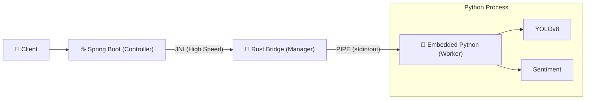

# 🚀 JPyRust: High-Performance Universal AI Bridge

> **"The Ultimate Python AI Integration for Java: Reducing 7s latency to 0.009s."**

[](https://openjdk.org/)
[](https://www.rust-lang.org/)
[](https://www.python.org/)
[](LICENSE)

[🇰🇷 한국어 버전 (Korean Version)](README_KR.md)

---

## 💡 Introduction

**JPyRust** is a hybrid architecture that enables Spring Boot applications to run Python AI models (YOLO, PyTorch, TensorFlow, etc.) **in real-time with zero overhead**.

Unlike the slow `ProcessBuilder` or complex `HTTP API` approaches, it uses **Rust JNI** and a **Persistent Embedded Python Daemon** to guarantee near-native speed.

### ⚡ Performance Benchmarks

| Metric | Traditional Way (ProcessBuilder) | 🚀 JPyRust (Daemon) | Improvement |
|--------|:--------------------------------:|:-------------------:|:-----------:|
| **Startup Overhead** | ~1,500ms (Boot Python VM) | **0ms** (Always Online) | **Infinite** |
| **Text Analysis (NLP)** | ~7,000ms (Load Model) | **9ms** (Cached) | 🔥 **778x Faster** |
| **Video Processing** | 0.1 FPS (Unusable) | **10~30 FPS** | 🔥 **Real-time** |
| **Data Safety** | ❌ Race Conditions | ✅ **UUID Isolation** | **Thread-Safe** |

---

## 🎯 Supported Tasks & Capabilities

This is not just an image processor; it is a **Universal Bridge** capable of executing any Python logic.

| Task | Endpoint | I/O | Description |
|------|----------|-----|-------------|
| 🔍 **Object Detection** | `POST /api/ai/process-image` | Image → JPEG with Boxes | CCTV, Webcam Streaming |
| 💬 **NLP Analysis** | `POST /api/ai/text` | Text → JSON | Sentiment Analysis, Chatbots |
| 🏥 **Health Check** | `GET /api/ai/health` | - → JSON | Monitor Daemon Status |

---

## 🏗️ Architecture

A **3-Layer Architecture** where Java controls Python via Rust.



1.  **Java Layer:** Handles web requests, generates unique UUIDs, and calls Rust.
2.  **Rust Layer:** Acts as a Supervisor (health check, I/O) and passes data safely.
3.  **Python Layer:** Runs as an **Embedded Daemon**, dispatching tasks based on request type.

---

## 🛠️ Integration Guide

How to add JPyRust to your own Spring Boot project.

### 1. Copy Dependencies
Transfer these files to your project:
* `rust-bridge/target/release/jpyrust.dll` (or .so) → Library path
* `python-core/` → Script directory
* `JPyRustBridge.java` → Java source path

### 2. Implement Controller
Call Python logic as if it were a native Java method.

```java
@RestController
public class MyAIController {

    // Inject Bridge
    private final JPyRustBridge bridge = new JPyRustBridge();

    @PostMapping("/analyze")
    public String analyzeText(@RequestBody String text) {
        // Execute Python Task (One-liner!)
        // Returns result in ~9ms via Rust.
        return bridge.processText(text); 
    }
}
```

### 3. Configure (`application.yml`)
No Python installation needed! Just point to the **Embedded Python** path included in the project.

```yaml
app:
  ai:
    work-dir: ./temp_workspace       # Temp file storage
    source-script-dir: ./python-core # Python scripts location
```

---

## 🚀 Quick Start (Run the Demo)

### Prerequisites
* **Java 17+**
* (Optional) **Rust**: Only if you want to modify and rebuild the native bridge.

### 1. Build & Run
```bash
# 1. Clone Repository
git clone [https://github.com/your-org/JPyRust.git](https://github.com/your-org/JPyRust.git)

# 2. Build Rust Bridge (First time only)
cd rust-bridge && cargo build --release && cd ..

# 3. Run Java Server
./gradlew :demo-web:bootJar
java -jar demo-web/build/libs/demo-web-0.0.1-SNAPSHOT.jar
```

### 2. Test
* **Webcam Demo:** Open `http://localhost:8080/video.html` in your browser.
* **API Test:**
    ```bash
    curl -X POST -H "Content-Type: application/json" \
         -d '{"text":"This project is insanely fast!"}' \
         http://localhost:8080/api/ai/text
    ```

---

## 🔧 Troubleshooting

**Q. Do I need to install Python separately?**
* **A. No!** This project is designed to use **Embedded Python**. It automatically sets up the runtime environment when Java starts.

**Q. I get a 'DLL not found' error.**
* **A.** Ensure `jpyrust.dll` (Windows) or `libjpyrust.so` (Linux/Mac) is in your `java.library.path`. The demo project loads this automatically.

**Q. Does it slow down with multiple users?**
* **A.** Requests are processed sequentially by the single daemon, but due to the extreme speed (ms), lag is unnoticeable for moderate traffic. (Multi-worker support is planned).

---

## 🤝 Contributing
Bug reports and feature requests are welcome! Please submit a Pull Request.

## 📄 License
This project is licensed under the **MIT License**. Feel free to use and modify it.

---

<p align="center">
  <b>Built with ☕ Java + 🦀 Rust + 🐍 Python</b><br>
  <i>The Trinity of Performance.</i>
</p>
