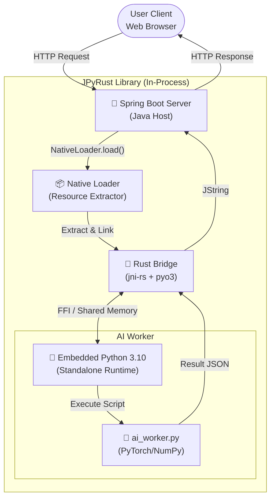
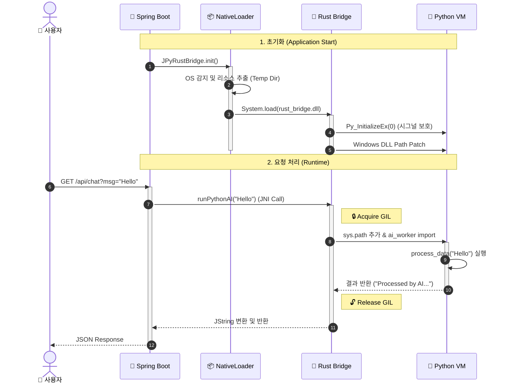
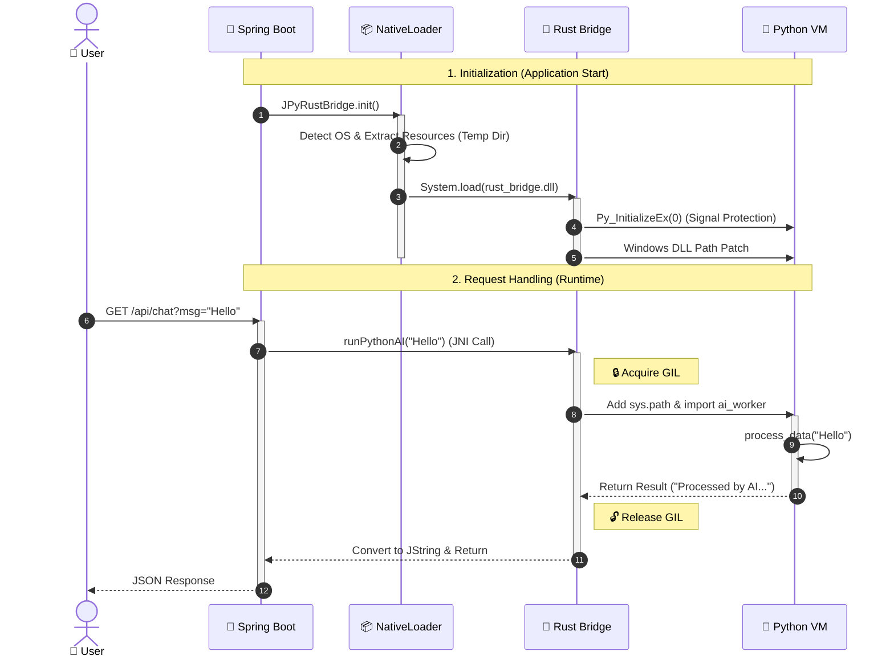

# 🌉 JPyRust: Zero-Config Java-Python Bridge

> "Stop asking users to install Python."

JPyRust는 Java 애플리케이션 내에 독립적인 Python 런타임을 내장하여, 사용자의 환경 설정(Python 설치, pip install 등) 없이도 AI 모델을 즉시 실행할 수 있게 해주는 고성능 라이브러리입니다.

---

# 🇰🇷 Korean Version

## 🏗️ System Architecture (시스템 아키텍처)
**Polyglot Runtime Environment**
Java(Host), Rust(Bridge), Python(Worker)이 하나의 프로세스 메모리를 공유하며 동작합니다.



<br>

## 🚀 Key Features (핵심 기능)

### 1. 📦 Zero-Config Deployment (무설정 배포)
- **Standalone Runtime**: 사용자의 PC에 Python이 설치되어 있지 않아도 됩니다. JAR 파일 내부에 최적화된 **Python 3.10 런타임(ZIP)**을 내장하고 있습니다.
- **Smart NativeLoader**: 앱 실행 시 OS(Windows/Linux/Mac)를 감지하여, 필요한 DLL/SO 파일과 Python 런타임을 임시 디렉터리로 자동 추출하고 로드합니다.

### 2. 🛡️ Memory Safety & Stability (안전성)
- **Rust Safety Valve**: C/C++ 기반 JNI(JEP 등)와 달리, Rust의 소유권 모델을 통해 메모리 누수와 포인터 오류(SegFault)를 원천 차단합니다.
- **Signal Handling Protection**: Python 인터프리터가 JVM의 시그널 핸들러(SIGINT, SIGSEGV)를 덮어쓰지 않도록 저수준(Py_InitializeEx)에서 제어하여 JVM 비정상 종료를 방지합니다.

### 3. ⚡ High Performance (고성능)
- **No ProcessBuilder**: 느린 프로세스 포크(ProcessBuilder)나 HTTP 통신 대신, **JNI(Java Native Interface)**를 통해 메모리 공간을 공유합니다.
- **GIL Management**: Rust 레벨에서 Python의 GIL(Global Interpreter Lock) 획득/해제를 명시적으로 관리하여, 멀티스레드 환경(Spring Boot)에서도 데드락(Deadlock) 없는 안정적인 동시성을 제공합니다.

## 📂 Project Structure (프로젝트 구조)
**Multi-Module Polyglot Project**
Java, Rust, Python, Web 코드가 유기적으로 결합된 구조입니다.

```plaintext
.
├── architecture.md             # [Doc] 아키텍처 설계 문서
├── docker-compose.yml          # [Infra] Docker 배포 설정
├── Dockerfile                  # [Infra] Multi-stage 빌드 스크립트
├── settings.gradle.kts         # [Gradle] 멀티 모듈 설정
├── java-api                    # [Module] Java 라이브러리 (Core)
│   ├── src/main/java
│   │   └── com/jpyrust
│   │       ├── NativeLoader.java   # [Core] DLL 및 Python 런타임 자동 추출기
│   │       └── JPyRustBridge.java  # [API] 사용자 제공 Native Interface
│   └── src/main/resources
│       └── natives             # [Res] 플랫폼별 빌드된 라이브러리 (.dll, .so)
├── rust-bridge                 # [Module] Rust JNI 구현체
│   ├── Cargo.toml              # [Rust] jni, pyo3 의존성 정의
│   └── src
│       └── lib.rs              # [Code] JNI 함수 구현 및 Python VM 제어 로직
├── python-core                 # [Module] AI/ML 로직
│   └── ai_worker.py            # [Code] 실제 연산을 수행하는 Python 스크립트
└── demo-web                    # [Module] Spring Boot 예제 서버
    └── src/main/java/.../AIController.java # 웹 API 엔드포인트
```

## 🔄 Logic Flow (실행 흐름도)
웹 요청이 들어왔을 때, Java에서 Rust를 거쳐 Python AI가 실행되는 과정입니다.



## 📜 Version History (개발 연혁)

| 버전 | 단계 | 주요 성과 |
| :--- | :--- | :--- |
| **v0.1** | PoC | Java-Rust-Python 기본 통신 파이프라인(JNI Pipeline) 구축 성공 |
| **v0.2** | Zero-Config | NativeLoader 구현. `-Djava.library.path` 옵션 제거 및 자동 로딩 성공 |
| **v0.3** | Desert Mode | Standalone Python(3.10) 내장. 로컬 Python 설치 없이 실행 가능 구현 |
| **v0.4** | Safety Patch | SIGINT 충돌 방지 및 Windows DLL 경로 문제 해결 (안정성 확보) |
| **v1.0** | Release | Spring Boot 연동 및 Docker 멀티 스테이지 빌드 지원. 최종 배포 버전 |

---

# 🇺🇸 English Version

## 🏗️ System Architecture
**Polyglot Runtime Environment**
Java (Host), Rust (Bridge), and Python (Worker) operate within a single shared process memory.


<br>

## 🚀 Key Features

### 1. 📦 Zero-Config Deployment
- **Standalone Runtime**: The end-user does not need Python installed. The JAR file contains an optimized **Python 3.10 Runtime (ZIP)**.
- **Smart NativeLoader**: Detects the OS (Windows/Linux/Mac) at runtime, automatically extracts the necessary DLLs/SOs and Python runtime to a temporary directory, and links them dynamically.

### 2. 🛡️ Memory Safety & Stability
- **Rust Safety Valve**: Unlike C/C++ based JNI (e.g., JEP), Rust's ownership model prevents memory leaks and pointer errors (SegFaults) at the source.
- **Signal Handling Protection**: Prevents the Python interpreter from hijacking the JVM's signal handlers (SIGINT, SIGSEGV) using low-level control (Py_InitializeEx), ensuring JVM stability.

### 3. ⚡ High Performance
- **No ProcessBuilder**: Avoids slow process forking (ProcessBuilder) or HTTP overhead. It uses **JNI (Java Native Interface)** to share memory space.
- **GIL Management**: Explicitly manages the Python GIL (Global Interpreter Lock) acquisition/release at the Rust level, ensuring deadlock-free concurrency even in multi-threaded environments like Spring Boot.

## 📂 Project Structure
**Multi-Module Polyglot Project**
Organically combines Java, Rust, Python, and Web code.

```plaintext
.
├── architecture.md             # [Doc] Architecture Design Document
├── docker-compose.yml          # [Infra] Docker Deployment Config
├── Dockerfile                  # [Infra] Multi-stage Build Script
├── settings.gradle.kts         # [Gradle] Multi-module Settings
├── java-api                    # [Module] Java Library (Core)
│   ├── src/main/java
│   │   └── com/jpyrust
│   │       ├── NativeLoader.java   # [Core] Auto-extractor for DLLs & Python Runtime
│   │       └── JPyRustBridge.java  # [API] User-facing Native Interface
│   └── src/main/resources
│       └── natives             # [Res] Platform-specific Binaries (.dll, .so)
├── rust-bridge                 # [Module] Rust JNI Implementation
│   ├── Cargo.toml              # [Rust] Dependencies (jni, pyo3)
│   └── src
│       └── lib.rs              # [Code] JNI Functions & Python VM Control Logic
├── python-core                 # [Module] AI/ML Logic
│   └── ai_worker.py            # [Code] Python script performing actual logic
└── demo-web                    # [Module] Spring Boot Demo Server
    └── src/main/java/.../AIController.java # Web API Endpoint
```

## 🔄 Logic Flow
The process flow from a Web Request -> Java -> Rust -> Python AI execution.



## 📜 Version History

| Version | Stage | Key Achievement |
| :--- | :--- | :--- |
| **v0.1** | PoC | Established basic Java-Rust-Python communication pipeline (JNI Pipeline). |
| **v0.2** | Zero-Config | Implemented NativeLoader. Removed `-Djava.library.path` requirement. |
| **v0.3** | Desert Mode | Embedded Standalone Python(3.10). Enabled offline execution without local Python installation. |
| **v0.4** | Safety Patch | Patched SIGINT conflicts and fixed Windows DLL path issues. |
| **v1.0** | Release | Integrated with Spring Boot and added Docker multi-stage build support. |

---

## ⚙️ Setup & Run

### 1. Prerequisites
- Java 17+ (JDK)
- Rust (Cargo, only required for building from source)
- Docker (for containerized execution)

### 2. Run with Gradle (Local)

```bash
# 1. Build Rust Library (Release Mode)
cd rust-bridge
cargo build --release

# 2. Copy Resources (Can be automated)
# (Skip if dll/so is already in the natives folder)

# 3. Run Spring Boot Demo
cd ../demo-web
./gradlew bootRun
```
  * Access: `http://localhost:8080/api/ai/chat?message=HelloJPyRust&id=1`

### 3. Run with Docker (Recommended)
Use Docker to test in a clean environment without Python or Rust installed.

```bash
# Build & Run Docker Image
docker build -t jpyrust-demo .
docker run -p 8080:8080 jpyrust-demo
```