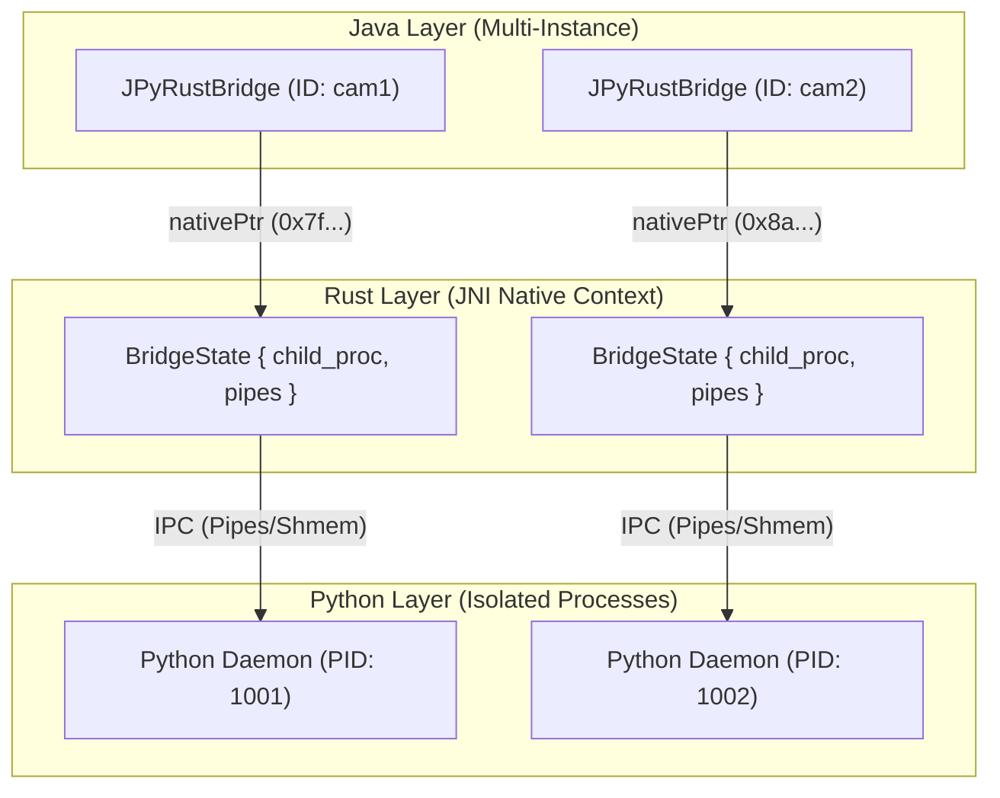
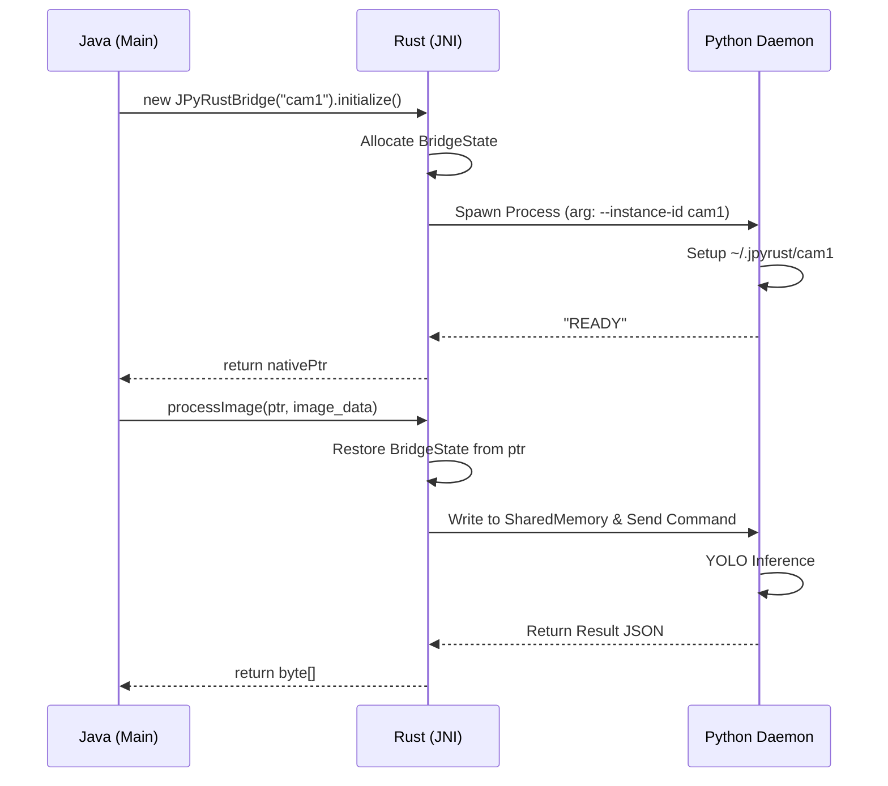

# 🚀 JPyRust: High-Performance Universal AI Bridge

> **"The Ultimate Python AI Integration for Java: Reducing 7s latency to 0.04s."**


[](https://openjdk.org/)
[](https://www.rust-lang.org/)
[](https://www.python.org/)

[🇰🇷 한국어 버전 (Korean Version)](README_KR.md)

---

## 💡 Introduction

**JPyRust** is a hybrid architecture that enables **Spring Boot** and Java applications to run Python AI models (YOLO, PyTorch, TensorFlow, etc.) in **real-time with high performance**.

Unlike the slow `ProcessBuilder` or complex HTTP API approaches, JPyRust uses **Rust JNI** and a **Persistent Embedded Python Daemon** to guarantee near-native speed.

## 🚀 Key Features (v1.3.0)

- **Multi-Instance Support**: Run multiple independent Python workers (e.g., `cam1`, `cam2`) concurrently within a single Java application.
- **Zero-Static Architecture**: Fully object-oriented API for isolated instance management.
- **Hybrid IPC**: Blazing fast Shared Memory (SHMEM) for heavy data (images/tensors) and reliable File/Pipe IPC for configuration.
- **Cross-Platform**: Optimized for Windows (permisive SHMEM) and Linux.
- **Embedded Python**: Automatically manages an isolated Python environment, no manual setup required.

## ⚡ Performance

| Feature | Local Command Line | HTTP API (FastAPI) | **JPyRust** |
| :--- | :---: | :---: | :---: |
| **Latency** | 🔴 Slow (VM Startup) | 🟡 Medium (Network) | 🟢 **Instant (Shared Memory)** |
| **Start Overhead**| ~1,500ms | 0ms (Once started) | **0ms** (Persistent Daemon) |
| **YOLO Detect** | ~2,000ms | ~100ms | **~40ms** (GPU) |
| **Throughput** | Sequential | Concurrent (Complex) | **True Parallel (Multi-Instance)** |

---

## 🚀 Quick Start

### 1. Dependency
```kotlin
implementation("com.github.farmer0010:JPyRust:v1.3.0")
```

### 2. Multi-Instance Usage

```java
import com.jpyrust.JPyRustBridge;

public class Main {
    public static void main(String[] args) {
        // 1. Create independent instances with unique IDs
        // Each instance manages its own Rust context and Python process
        JPyRustBridge cam1 = new JPyRustBridge("cam1");
        JPyRustBridge cam2 = new JPyRustBridge("cam2");

        // 2. Initialize (Spawns independent Python processes in ~/.jpyrust/camX)
        // You can specify a custom working directory if needed
        cam1.initialize(); 
        cam2.initialize(); 

        // 3. Process data concurrently
        // Camera 1: YOLO Object Detection
        byte[] res1 = cam1.processImage(buffer1, len1, 640, 480, 3);
        
        // Camera 2: YOLO Object Detection
        byte[] res2 = cam2.processImage(buffer2, len2, 640, 480, 3);
        
        // 4. NLP Task
        JPyRustBridge nlp = new JPyRustBridge("nlp");
        nlp.initialize();
        String sentiment = nlp.processNlp("JPyRust is blazing fast!");
    }
}
```

### 3. Instance Lifecycle
Each `JPyRustBridge` object corresponds to a unique:
- **Rust `BridgeState` Struct**: Holds handles to the Python process and IPC pipes.
- **Python Process**: Runs independently.
- **Working Directory**: `~/.jpyrust/<instance_id>/` ensuring no file conflicts.

---

## 🏗️ Architecture (v1.3.0)

JPyRust v1.3.0 abandoned the global static singleton pattern in favor of a robust pointer-based object system. This allows for true parallelism and isolation.

### Component Diagram



### Execution Flow (Sequence)



---

## 🎯 Supported Tasks

The library comes with built-in support for the following tasks, but is easily extensible via plugins.

| Task | Method | IPC Mode | Library |
|------|--------|----------|---------|
| 🔍 **Object Detection** | `processImage(...)` | SHMEM | `Ultralytics (YOLOv8)` |
| 🧠 **NLP Analysis** | `processNlp(...)` | FILE | `TextBlob` |
| 📈 **Regression** | `processRegression(...)` | FILE | `Scikit-Learn` |
| 🎨 **Edge Detection** | `processEdgeDetection(...)` | SHMEM | `OpenCV` |

---

## ⚠️ Hardware Acceleration

JPyRust automatically detects your hardware:
- **NVIDIA GPU**: Used if CUDA is available (~40ms inference).
- **CPU Fallback**: Used if no GPU is found (~100ms inference).

No manual configuration is required. The Python daemon self-configures on startup.

---

## 🔧 Troubleshooting

### Common Issues

1. **`UnsatisfiedLinkError`**:
   - Ensure `jpyrust.dll` (Windows) or `libjpyrust.so` (Linux) is in `java.library.path`.
   - Run `cargo build --release` in `rust-bridge` if building from source.

2. **`WinError 5 (Access Denied)`**:
   - v1.3.0 handles this with isolated instance directories. Ensure your antivirus isn't blocking the `.jpyrust` folder.

3. **Python Daemon Exits Immediately**:
   - Check `~/.jpyrust/<id>/logs` (if enabled) or run with `debug=true`.
   - Ensure Python 3.11+ is installed or allow JPyRust to bootstrap it.

---

## 📜 Version History

*   **v1.3.0 (Current)**:
    *   **Multi-Instance Support**: Concurrent Python workers.
    *   **Refactored Core**: Removed all static state.
    *   **API Update**: `new JPyRustBridge(id)` constructor.

*   **v1.1.5**:
    *   Fixed `WinError 5` with dynamic shared memory keys.
    *   Added plugin system.

*   **v1.0.0**: 
    *   Initial release with Universal Bridge Architecture.

---

## 📄 License
MIT License
