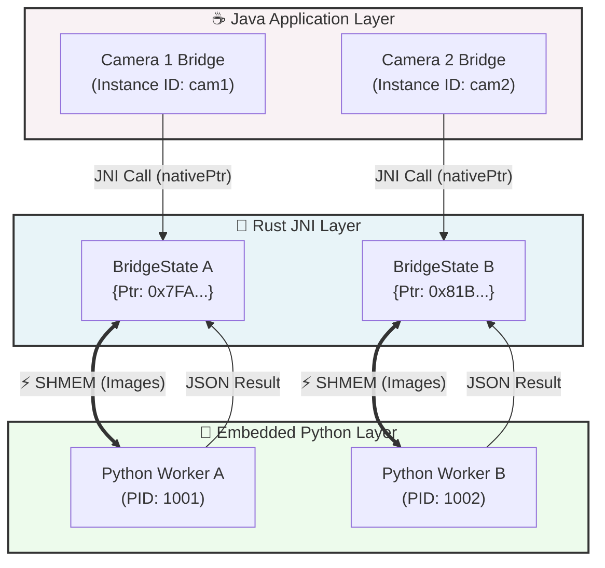
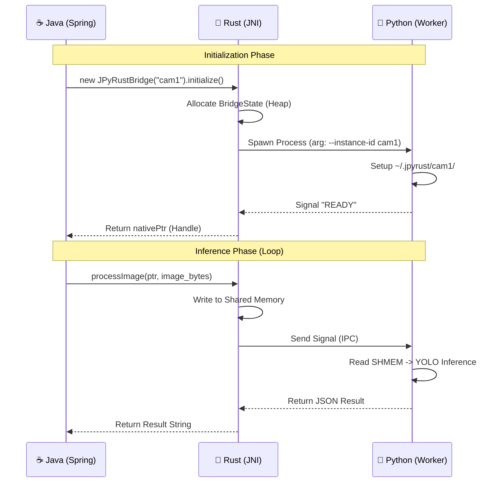

# 🚀 JPyRust: High-Performance Universal AI Bridge

> **"A persistent Python worker for Java, reached over JNI + shared memory instead of a subprocess per call."**

[](https://github.com/farmer0010/JPyRust/actions)
[](https://jitpack.io/#farmer0010/JPyRust)
[](LICENSE)


<p align="center">
  <a href="https://openjdk.org/">
    
  </a>
  <a href="https://www.rust-lang.org/">
    
  </a>
  <a href="https://www.python.org/">
    
  </a>
</p>

<div align="center">
  <a href="README_KR.md">🇰🇷 한국어 버전 (Korean Version)</a>
</div>

---

## 💡 Introduction

**JPyRust** is a hybrid architecture designed to bridge the gap between **Java's robustness** and **Python's AI ecosystem**. It enables Spring Boot applications to execute heavy AI models (YOLO, PyTorch, TensorFlow) with **near-native performance**.

Unlike slow `ProcessBuilder` or high-latency HTTP APIs, JPyRust leverages **Rust JNI** and **Shared Memory (SHMEM)** to achieve sub-millisecond communication.

### 🌟 Why JPyRust?
* 🚀 **Zero-Latency**: Uses System RAM (Shared Memory) instead of HTTP/Sockets.
* 🔄 **True Parallelism**: v1.3.0 supports **Multi-Instance** architecture (1 Java App connects to N Python Processes).
* 🛠️ **Zero-Config**: Auto-installs a secluded Embedded Python environment. No `pip install` hell.
* 🛡️ **Crash-Proof**: Rust monitors Python health and auto-restarts workers if they crash.

---

## 🏗️ Architecture (v1.3.0)

With the **v1.3.0 update**, JPyRust has moved from a generic Singleton pattern to a **Multi-Instance Object-Oriented Architecture**. This allows a single Java application to control multiple independent AI workers (e.g., Multi-Channel CCTV processing).

### 🧩 System Component Diagram


```mermaid
graph TD
    subgraph JavaApp [☕ Java Application Layer]
        style JavaApp fill:#f9f2f4,stroke:#333,stroke-width:2px
        J1["Camera 1 Bridge<br>(Instance ID: cam1)"]
        J2["Camera 2 Bridge<br>(Instance ID: cam2)"]
    end

    subgraph NativeLayer [🦀 Rust JNI Layer]
        style NativeLayer fill:#e8f4f8,stroke:#333,stroke-width:2px
        R1["BridgeState A<br>{Ptr: 0x7FA...}"]
        R2["BridgeState B<br>{Ptr: 0x81B...}"]
    end

    subgraph PythonLayer [🐍 Embedded Python Layer]
        style PythonLayer fill:#edfbec,stroke:#333,stroke-width:2px
        P1["Python Worker A<br>(PID: 1001)"]
        P2["Python Worker B<br>(PID: 1002)"]
    end

    J1 -- "JNI Call (nativePtr)" --> R1
    J2 -- "JNI Call (nativePtr)" --> R2
    
    R1 <== "⚡ SHMEM (Images)" ==> P1
    R2 <== "⚡ SHMEM (Images)" ==> P2
    
    P1 -- "JSON Result" --> R1
    P2 -- "JSON Result" --> R2
```

### ⚡ Execution Sequence


```mermaid
sequenceDiagram
    participant Java as ☕ Java (Spring)
    participant Rust as 🦀 Rust (JNI)
    participant Py as 🐍 Python (Worker)

    Note over Java, Py: Initialization Phase
    Java->>Rust: new JPyRustBridge("cam1").initialize()
    Rust->>Rust: Allocate BridgeState (Heap)
    Rust->>Py: Spawn Process (arg: --instance-id cam1)
    Py->>Py: Setup ~/.jpyrust/cam1/
    Py-->>Rust: Signal "READY"
    Rust-->>Java: Return nativePtr (Handle)

    Note over Java, Py: Inference Phase (Loop)
    Java->>Rust: processImage(ptr, image_bytes)
    Rust->>Rust: Write to Shared Memory
    Rust->>Py: Send Signal (IPC)
    Py->>Py: Read SHMEM -> YOLO Inference
    Py-->>Rust: Return JSON Result
    Rust-->>Java: Return Result String
```

---

## ⚡ Performance Benchmark

A real, runnable benchmark ships with the repo: [`LatencyBenchmark.java`](java-api/src/test/java/com/jpyrust/LatencyBenchmark.java). It runs real YOLOv8n inference on an actual image (`sample.png`), 10 iterations after warmup, comparing:
- **Legacy Subprocess** — spawns a brand-new Python interpreter (full torch/ultralytics import + model load) for every single call.
- **JPyRust (JNI + SHMEM)** — reuses one persistent Python daemon with the model already loaded; only the image crosses via shared memory.

| Architecture | Communication | Latency (Avg, measured) |
| :--- | :--- | :---: |
| Legacy Subprocess (cold spawn per call) | Stdin/Stdout | ~2,330 ms |
| JPyRust (JNI + SHMEM, persistent daemon) | Shared Memory | ~6 ms |

> *Measured on: Apple Silicon (arm64), macOS, PyTorch with MPS (Metal) acceleration, Python 3.12. ~390x faster, consistent across repeated runs.*

Nearly all of the "legacy" cost is one-time interpreter/library/model-load overhead (torch + ultralytics import, `YOLO(...)` construction) paid on *every single call* — the actual inference itself is only a few milliseconds. The daemon architecture pays that cost once at startup instead of per-request, which is the entire point of keeping a persistent worker around. Run `LatencyBenchmark` yourself to reproduce this against your own hardware — numbers will vary with CPU/GPU and image size, but the shape of the result (overhead dominates, not compute) should hold generally.

<details>
<summary><strong>A note on getting this number honestly</strong></summary>

Earlier drafts of this benchmark quietly measured the wrong thing on macOS: a POSIX shared-memory naming mismatch between Rust and Python made every SHMEM call silently fail and fall through a 15-attempt retry loop (~1.8s of pure backoff, not compute), and the benchmark fed it random bytes instead of a real image, so `cv2.imdecode` failed instantly on both paths without ever running inference. Both are fixed now — see [Version History](#-version-history).
</details>

---

## 🚀 Quick Start

### 1. Installation (Gradle)
Add the JitPack repository and dependency to your `build.gradle.kts`:

```kotlin
repositories {
    maven { url = uri("[https://jitpack.io](https://jitpack.io)") }
}

dependencies {
    // Latest stable version
    implementation("com.github.farmer0010:JPyRust:v1.3.0")
}
```

### 2. Usage (Java)

**Important:** As of v1.3.0, static methods are removed. You must instantiate `JPyRustBridge`.

```java
import com.jpyrust.JPyRustBridge;

public class VisionService {
    
    public void startDetection() {
        // 1. Create independent instances for each camera
        JPyRustBridge cam1 = new JPyRustBridge("cam1");
        JPyRustBridge cam2 = new JPyRustBridge("cam2");

        // 2. Initialize (Spawns workers in ~/.jpyrust/camX)
        cam1.initialize(); 
        cam2.initialize(); 

        // 3. Process Images (Thread-Safe)
        // arg: (imageData, length, width, height, channels)
        byte[] result1 = cam1.processImage(imgData1, len1, 640, 480, 3);
        byte[] result2 = cam2.processImage(imgData2, len2, 640, 480, 3);
        
        System.out.println("Cam1 Result: " + new String(result1));
    }
}
```

---

## 🛠️ Configuration & Troubleshooting

<details>
<summary><strong>🔧 1. UnsatisfiedLinkError / DLL Not Found</strong></summary>

* **Cause:** Java cannot find the native library.
* **Fix:** The library is automatically extracted to `AppData/Local/Temp`. If it fails, ensure `jpyrust.dll` (Windows) or `libjpyrust.so` (Linux) is in your library path.
</details>

<details>
<summary><strong>🛡️ 2. WinError 5 (Access Denied)</strong></summary>

* **Cause:** Windows Security permissions on Shared Memory.
* **Fix:** JPyRust v1.2+ uses explicit `SECURITY_ATTRIBUTES` with SDDL `D:(A;;GA;;;WD)` to allow Full Access to the Python child process. No manual action required.
</details>

<details>
<summary><strong>🐍 3. Python Dependency Issues</strong></summary>

* **Windows:** JPyRust includes a **portable embedded Python**. It bootstraps itself in `~/.jpyrust/<instanceId>/python_dist`.
* **macOS / Linux:** there is no portable embedded Python for these platforms, so JPyRust instead looks for a `python3` on your `PATH` (tries `python3.12`, `python3.11`, `python3.13`, then `python3`) and provisions a private virtualenv at `~/.jpyrust/<instanceId>/venv`, installing `requirements.txt` into it. This runs once per instance directory (tracked by a `.installed` marker) — delete that directory to force a clean reinstall.
* If libraries are missing, check `requirements.txt` in the resource folder.
</details>

---

## 📜 Version History

* **Unreleased**
    * **Fix:** macOS/Linux now provision a real Python venv instead of unconditionally extracting the Windows-only embedded distribution (which silently couldn't run on those platforms).
    * **Fix:** Shared memory names Rust creates on macOS/Linux never matched what Python's `multiprocessing.shared_memory` looked for (`shm_open()` needs a leading `/`, and the Rust side wasn't adding one), so every SHMEM call on macOS silently failed and burned ~1.8s exhausting a retry loop before giving up. Names now match on both sides.
    * **Fix:** Shared memory segment names could also exceed macOS's 31-character `shm_open` limit. Names are now kept short on all platforms.
    * **Fix:** The native daemon looked for `ai_worker.py` directly under the instance work dir, but it was only ever staged inside `python_dist/` — the daemon could never find it. The worker script is now placed at the expected path on every platform.
    * **Fix:** The legacy subprocess benchmark path called `ai_worker.py` with a calling convention it no longer supports (positional args instead of the daemon's stdin protocol), which hung forever. It now speaks the same EXECUTE/stdin protocol as the daemon.
    * **Fix:** `ai_worker.py` only checked `torch.cuda.is_available()`, so it never used Apple's Metal (MPS) backend on Apple Silicon — it now also tries `mps` before falling back to `cpu`.
    * **Fix:** The benchmark sent random bytes as "image data" into a YOLO task that decodes via `cv2.imdecode()`, which fails instantly on non-image bytes — so it never actually ran inference on either path. It now sends a real image.

* **v1.3.0**
    * **Major Refactor:** Switched to Multi-Instance Architecture.
    * **Breaking Change:** Removed static methods; added Constructor-based instantiation.
    * **Feature:** Isolated working directories per instance (`~/.jpyrust/cam1`).

* **v1.2.0**
    * **Performance:** Restored Shared Memory (SHMEM) on Windows via Win32 API.
    * **Security:** Fixed `WinError 5` using custom Security Descriptors.

* **v1.1.0**
    * Initial Windows Support & File-based IPC fallback.

---

## 📄 License

This project is licensed under the **MIT License** - see the [LICENSE](LICENSE) file for details.

<div align="center">
  <sub>Built with 🦀 Rust & ☕ Java by Farmer0010 (JPyRust Team).</sub>
</div>
