# 🚀 JPyRust: High-Performance Universal AI Bridge

> **"The Ultimate Python AI Integration for Java: Reducing 7s latency to 0.04s."**


[](https://openjdk.org/)
[](https://www.rust-lang.org/)
[](https://www.python.org/)

[🇰🇷 한국어 버전 (Korean Version)](README_KR.md)

---

## 💡 Introduction

**JPyRust** is a hybrid architecture that enables **Spring Boot** applications to run Python AI models (YOLO, PyTorch, TensorFlow, etc.) in **real-time with zero overhead**.

Unlike the slow `ProcessBuilder` or complex HTTP API approaches, it uses **Rust JNI** and a **Persistent Embedded Python Daemon** to guarantee near-native speed.

## 📜 Version History

*   **v1.0 (Official Release)**:
    *   Universal Bridge Architecture (Java-Rust-Python)
    *   Intelligent IPC Selection (SHMEM for Images, File for Text)
    *   Multi-OS Support (Windows, Linux, macOS)
    *   Embedded Python & Auto-Dependency Management
    *   GPU Auto-Detection


### 🚀 Why JPyRust? (Vs. Alternatives)

| Feature | Local Command Line | HTTP API (FastAPI/Flask) | **JPyRust** |
| :--- | :---: | :---: | :---: |
| **Latency** | 🔴 Slow (VM Startup) | 🟡 Medium (Network Overhead) | 🟢 **Instant (Shared Memory)** |
| **Complexity** | 🟡 Medium (Parsing pipes) | 🔴 High (Managing microservices) | 🟢 **Low (Single Monolith)** |
| **Deployment** | 🟢 Easy | 🔴 Hard (Requires Docker/Orch) | 🟢 **Easy (Embedded Clone)** |

---

## ⚡ Performance Benchmarks

| Metric | Traditional Way (ProcessBuilder) | 🚀 JPyRust (v1.0) | Improvement |
|--------|:--------------------------------:|:-------------------:|:-----------:|
| **Startup Overhead** | ~1,500ms (Boot Python VM) | **0ms** (Always Online) | **Infinite** |
| **Object Detection (YOLO)** | ~2,000ms | **~100ms** (CPU) / **~40ms** (GPU) | 🔥 **50x Faster** |
| **Text Analysis (NLP)** | ~7,000ms (Load Model) | **~50ms** (File IPC) | 🔥 **140x Faster** |
| **Data Transfer** | Disk I/O (Thrashing) | **Hybrid (SHMEM/File)** | **Optimized** |

---

## ⚠️ Hardware Acceleration (GPU)

JPyRust includes intelligent hardware detection:

> **Auto-Detection Enabled:**
> *   **GPU Mode:** Automatically activated if NVIDIA Drivers & CUDA Toolkit are installed.  
>     *(Speed: ~0.04s / 25+ FPS)*
> *   **CPU Mode:** If CUDA is missing, it **automatically falls back** to CPU.  
>     *(Speed: ~0.10s / 10+ FPS)*
> *   *No configuration needed.*

---

## 🎯 Supported Tasks & Capabilities

The following "Standard Battery" is included out-of-the-box:

| Task | Endpoint | IPC Mode | Libs | Description |
|------|----------|----------|-----|-------------|
| 🔍 **Object Detection** | `processImage` | SHMEM | `Ultralytics (YOLO)` | CCTV, Webcam Streaming |
| 🧠 **NLP Analysis** | `processNlp` | FILE | `TextBlob` | Sentiment Analysis |
| 📈 **Data Science** | `processRegression` | FILE | `Pandas`, `Scikit-Learn` | Linear Regression |
| 🎨 **Image Filter** | `processEdgeDetection` | SHMEM | `OpenCV` | Canny Edge Detection |

---

## 🏗️ Architecture

A 3-Layer Architecture where Java controls Python via Rust using **Intelligent IPC Selection**.

```mermaid
graph TD
    subgraph "Java Layer (Spring Boot)"
        Controller["☕ Controller"]
        JavaBridge["🔗 JPyRustBridge.java"]
        Dist["📦 Embedded Python (Internal)"]
    end

    subgraph "Rust Layer (JNI)"
        RustBridge["🦀 jpyrust.dll"]
        IPCSwitch{"Task Type?"}
    end

    subgraph "Python Layer (Daemon)"
        Daemon["🐍 Python Process"]
        Models["🧠 AI (YOLO/PANDAS/SKLEARN)"]
    end

    Controller --> JavaBridge
    JavaBridge -- "Extracts on 1st run" --> Dist
    JavaBridge -- "JNI Call" --> RustBridge
    RustBridge --> IPCSwitch
    
    IPCSwitch -- "Image (YOLO/Edge)" --> RAM_IN["💾 Shared Memory"]
    IPCSwitch -- "Text (NLP/Regression)" --> FILE_IN["📁 File IPC"]
    
    RAM_IN --> Daemon
    FILE_IN --> Daemon
    Daemon --> Models
```



**IPC Mode Selection:**
- **SHMEM (Shared Memory):** Used for large binary data (images, video frames)
- **FILE IPC:** Used for text-based tasks - ensures Windows compatibility

---

## 🧩 How to Extend (Add New Features)

### Adding a New Python Task

1.  **Python Side (`python-core/ai_worker.py`)**:
    ```python
    def handle_my_task(request_id, metadata):
        raw_data, meta, out_info = parse_input_protocol(request_id, metadata)
        # ... your logic ...
        result_bytes = result.encode('utf-8')
        bytes_written = write_output_data(request_id, result_bytes, out_info)
        return f"DONE {bytes_written}"

    TASK_HANDLERS = {
        "YOLO": handle_yolo_task,
        "MY_TASK": handle_my_task,
    }
    ```

2.  **Java Side (`JPyRustBridge.java`)**:
    ```java
    public String runMyTask(String input) {
        byte[] inputBytes = input.getBytes("UTF-8");
        ByteBuffer buffer = ByteBuffer.allocateDirect(inputBytes.length);
        buffer.put(inputBytes);
        buffer.flip();
        
        String requestId = UUID.randomUUID().toString();
        byte[] result = executeTask(workDir, "MY_TASK", requestId, "", buffer, inputBytes.length);
        return new String(result, "UTF-8");
    }
    ```

3.  **Adding New Python Libraries**:
    ```bash
    # Edit requirements.txt
    echo "new-library==1.0.0" >> requirements.txt
    
    # Restart server - dependencies auto-install
    ./gradlew :demo-web:bootRun
    ```

---

## 🛠️ Integration Guide

### 1. Build Configuration (`build.gradle.kts`)

```kotlin
dependencies {
    implementation(project(":java-api"))
}

tasks.withType<org.springframework.boot.gradle.tasks.run.BootRun> {
    systemProperty("java.library.path", file("../rust-bridge/target/release").absolutePath)
}
```

### 2. Application Configuration (`application.yml`)

```yaml
app:
  ai:
    work-dir: C:/jpyrust_temp
    source-script-dir: ./python-core
    model-path: yolov8n.pt
    confidence: 0.5
```

---

## 🚀 Quick Start

### Prerequisites
*   **Java 17+**
*   **Rust (Cargo)**: Required to build the native bridge
*   **Python**: Not required (Embedded Python auto-downloads)

### 1. Build & Run

```bash
# Clone Repository
git clone https://github.com/your-org/JPyRust.git
cd JPyRust

# Build Rust Bridge
cd rust-bridge
cargo build --release
cd ..

# Run Server (auto-downloads ~500MB Python on first run)
./gradlew :demo-web:bootRun
```

### 2. Test

*   **Features Demo**: `http://localhost:8080/features.html`
*   **Video Streaming**: `http://localhost:8080/video.html`

---

## 🔧 Troubleshooting

### Q. `UnsatisfiedLinkError: no jpyrust in java.library.path`
**A.** Run `cargo build --release` in `rust-bridge/` folder.

### Q. `Python daemon exited before sending READY`
**A.** Delete `C:/jpyrust_temp/` folder and restart.

### Q. NLP/Regression returns empty result?
**A.** Check server logs for `[Rust] Text task detected - using FILE IPC` message.

---

## 📜 Version History

*   **v1.1.5 (Stable Release)**:
    *   **JitPack Support**: Fixed build issues on JitPack (Gradle wrapper, sudo removal, Python task skipping).
    *   **Dynamic Shared Memory Key**: Fixed `WinError 5 (Access Denied)` on Windows restarts by using unique session UUIDs.
    *   **Observability**: Real-time monitoring of Python daemon (RAM, GPU) via `/api/status`.
    *   **Plugin System**: Dynamic loading of Python extensions from `python-core/plugins/`.
    *   **Docker Registry Guide**: Detailed guide for automating Docker Hub deployments via GitHub Actions.
*   **v1.0 (Official Release)**:
    *   Universal Bridge Architecture (Java-Rust-Python)
    *   Intelligent IPC Selection (SHMEM for Images, File for Text)
    *   Multi-OS Support (Windows, Linux, macOS)
    *   Embedded Python & Auto-Dependency Management
    *   GPU Auto-Detection

---

## 📅 Roadmap

*   [ ] **Docker Registry Integration**: Auto-push to Docker Hub on GitHub Release (Guide provided).
*   [ ] **GPU Resource Management**: Dynamic batching based on VRAM usage.
*   [ ] **Hot-Reloading**: Reload Python plugins without restarting the server.

---

## 📄 License

MIT License.

---

<p align="center">
  <b>Built with ☕ Java + 🦀 Rust + 🐍 Python</b><br>
  <i>The Trinity of Performance.</i>
</p>
