# 🚀 JPyRust: High-Performance Universal AI Bridge

> **"The Ultimate Python AI Integration for Java: Reducing 7s latency to 0.04s."**

[](https://openjdk.org/)
[](https://www.rust-lang.org/)
[](https://www.python.org/)
[](LICENSE)

[🇰🇷 한국어 버전 (Korean Version)](README_KR.md)

---

## 💡 Introduction

**JPyRust** is a hybrid architecture that enables **Spring Boot** applications to run Python AI models (YOLO, PyTorch, TensorFlow, etc.) in **real-time with zero overhead**.

Unlike the slow `ProcessBuilder` or complex HTTP API approaches, it uses **Rust JNI** and a **Persistent Embedded Python Daemon** to guarantee near-native speed.

**New in v2.2:** implemented **Level 2 Full Shared Memory Pipeline**, achieving **100% Disk-Free Inference** and **GPU Auto-Detection**.

---

## ⚡ Performance Benchmarks

| Metric | Traditional Way (ProcessBuilder) | 🚀 JPyRust (v2.2) | Improvement |
|--------|:--------------------------------:|:-------------------:|:-----------:|
| **Startup Overhead** | ~1,500ms (Boot Python VM) | **0ms** (Always Online) | **Infinite** |
| **Object Detection (YOLO)** | ~2,000ms | **~40ms** (GPU) / **~90ms** (CPU) | 🔥 **50x Faster** |
| **Text Analysis (NLP)** | ~7,000ms (Load Model) | **~9ms** (Zero-Copy RAM) | 🔥 **778x Faster** |
| **Data Transfer** | Disk I/O (Thrashing) | **100% Shared Memory** | **No Disk Wear** |

---

## ⚠️ Hardware Acceleration (GPU)

JPyRust v2.2 includes intelligent hardware detection:

> **Auto-Detection Enabled:**
> *   **GPU Mode:** Automatically activated if NVIDIA Drivers & CUDA Toolkit are installed.  
>     *(Speed: ~0.04s / 25+ FPS)*
> *   **CPU Mode:** If CUDA is missing, it **automatically falls back** to CPU.  
>     *(Speed: ~0.09s / 10+ FPS)*
> *   *No configuration needed.*

---

## 🎯 Supported Tasks & Capabilities

This is not just an image processor; it is a **Universal Bridge** capable of executing any Python logic.

| Task | Endpoint | I/O | Description |
|------|----------|-----|-------------|
| 🔍 **Object Detection** | `POST /api/ai/process-image` | **Full Shared Memory** | CCTV, Webcam Streaming |
| 💬 **NLP Analysis** | `POST /api/ai/text` | **Full Shared Memory** | Sentiment Analysis, Chatbots |
| 🏥 **Health Check** | `GET /api/ai/health` | - → JSON | Monitor Daemon Status |

---

## 🏗️ Architecture

A 3-Layer Architecture where Java controls Python via Rust using **Named Shared Memory**.

```mermaid
graph TD
    subgraph "Java Layer (Spring Boot)"
        Controller["☕ Controller"]
        JavaBridge["🔗 JPyRustBridge.java"]
        Dist["📦 Embedded Python (Internal)"]
    end

    subgraph "Rust Layer (JNI)"
        RustBridge["🦀 jpyrust.dll"]
    end

    subgraph "Python Layer (Daemon)"
        Daemon["🐍 Python Process"]
        Models["🧠 AI Models (YOLO/NLP)"]
    end

    Controller --> JavaBridge
    JavaBridge -- "Extracts on 1st run" --> Dist
    JavaBridge -- "JNI Call" --> RustBridge
    RustBridge -- "Spawn/Monitor" --> Daemon
    
    RustBridge -- "Write Input" --> RAM_IN["💾 Input SHM"]
    RAM_IN -- "Read Zero-Copy" --> Daemon
    Daemon -- "Process (GPU/CPU)" --> Models
    
    Models -- "Result" --> Daemon
    Daemon -- "Write Output" --> RAM_OUT["💾 Output SHM"]
    RAM_OUT -- "Read Result" --> RustBridge
```



1.  **Java Layer**: Handles web requests and calls Rust via JNI.
2.  **Rust Layer**: Supervisor. Allocates Input/Output Shared Memory buffers (`jpyrust_{uuid}`, `jpyrust_out_{uuid}`) and coordinates data flow.
3.  **Python Layer**: Embedded Daemon. Reads input from RAM, runs inference (GPU/CPU), and writes results back to RAM. **No disk access** occurs during inference.

---

## 🛠️ Integration Guide

How to add JPyRust to your own Spring Boot project.

### 1. Copy Dependencies

Transfer these files to your project:

*   `rust-bridge/target/release/jpyrust.dll` (or `.so`) → Library path
*   `python-core/` → Script directory (contains `ai_worker.py`)
*   `demo-web/src/main/java/com/jpyrust/JPyRustBridge.java` → Java source path

### 2. Implement Controller

Call Python logic as if it were a native Java method.

```java
@Controller
public class MyAIController {
    // Inject Bridge
    private final JPyRustBridge bridge = new JPyRustBridge();

    @PostMapping("/analyze")
    @ResponseBody
    public String analyzeText(@RequestBody String text) {
        // Execute Python Task (One-liner!)
        return bridge.processText(text); 
    }
}
```

### 3. Configure (`application.yml`)

```yaml
app:
  ai:
    work-dir: C:/jpyrust_temp        # Runtime temp directory
    source-script-dir: ./python-core # Path to Python scripts
    model-path: yolov8n.pt           # Model file name
    confidence: 0.5                  # Detection confidence threshold
```

---

## 🚀 Operational Excellence

### 1. Unified Logging
JPyRust routes **all logs** (Rust panic, Python stdout/stderr) to **Java's SLF4J**.  
You will see unified logs in your Spring Boot console:
```text
INFO [JPyRustBridge] [Native] [Rust] Spawning Python daemon...
INFO [JPyRustBridge] [Native] [Python] YOLO model loaded on CUDA
```

### 2. Thread Safety
The bridge is fully thread-safe and panic-proof. It uses **Global References** and **Daemon Attachment** to ensure stability even under high concurrency or if the background thread is interrupted.

---

## 📦 Pre-built Binaries

Don't want to install Rust?  
Download the pre-compiled library from the [Releases](../../releases) page:

*   **Windows**: `jpyrust.dll`
*   **Linux**: `libjpyrust.so`
*   **macOS**: `libjpyrust.dylib`

Place the file in `rust-bridge/target/release/` (or your system library path).

---

## 🔧 Troubleshooting

### Q. 'Shared Memory' or 'DLL' Error?
**A.** Since v2.2 introduced Shared Memory, please **Rebuild Rust Project**: `cd rust-bridge && cargo build --release`.

### Q. First Request Delay?
**A.** The embedded Python environment takes a few seconds (1-3s) to initialize and load the AI models (Torch/YOLO) into memory on the first run. Subsequent requests are instant (~40ms).

### Q. Is my GPU being used?
**A.** Check the logs on startup: `[Daemon] Device selected: CUDA` (or `CPU`).

## 🚀 Quick Start (Run the Demo)

### Prerequisites
*   **Java 17+**
*   *(Optional)* **Rust**: Only if you want to modify and rebuild the native bridge.

### 1. Build & Run

```bash
# 1. Clone Repository
git clone https://github.com/your-org/JPyRust.git

# 2. Build Rust Bridge (Rebuild required for v2.2)
cd rust-bridge && cargo build --release && cd ..

# 3. Run Java Server
./gradlew :demo-web:bootJar
java -jar demo-web/build/libs/demo-web-0.0.1-SNAPSHOT.jar
```

### 2. Test

*   **Webcam Demo**: Open `http://localhost:8080/video.html` in your browser.

---


## 📜 Version History

*   **v2.2**: **Full In-Memory Pipeline** (Input/Output) & **GPU Auto-detect**.
*   **v2.1**: Input Shared Memory IPC (Level 1).
*   **v2.0**: Embedded Python Self-Extraction.
*   **v1.0**: Initial JNI + File IPC implementation.

---

## 📄 License

MIT License.

---

<p align="center">
  <b>Built with ☕ Java + 🦀 Rust + 🐍 Python</b><br>
  <i>The Trinity of Performance.</i>
</p>
