# 🌉 JPyRust: Zero-Config Java-Python Bridge

> "Stop asking users to install Python."

[🇰🇷 Korean Version](README_KR.md)

---

## 🏗️ System Architecture
**Polyglot Runtime Environment**
Java (Host), Rust (Bridge), and Python (Worker) operate within a single shared process memory.

```mermaid
graph TD
    %% Client
    Client(["User Client<br>Web Browser"]) -->|HTTP Request| SpringBoot["🍃 Spring Boot Server<br>(Java Host)"]
%% JPyRust Area
subgraph "JPyRust Library (In-Process)"
    SpringBoot -->|"NativeLoader.load()"| Loader["📦 Native Loader<br>(Resource Extractor)"]
    Loader -->|"Extract & Link"| RustBridge["🦀 Rust Bridge<br>(jni-rs + pyo3)"]
    
    RustBridge <-->|"FFI / Shared Memory"| PythonVM["🐍 Embedded Python 3.10<br>(Standalone Runtime)"]
    
    subgraph "AI Worker"
        PythonVM -->|"Execute Script"| Logic["🧠 ai_worker.py<br>(PyTorch/NumPy)"]
    end
end
%% Data Flow
Logic -->|"Result JSON"| RustBridge
RustBridge -->|"JString"| SpringBoot
SpringBoot -->|"HTTP Response"| Client
```



<br>

## 🚀 Key Features

### 1. 📦 Zero-Config Deployment
- **Standalone Runtime**: The end-user does not need Python installed. The JAR file contains an optimized **Python 3.10 Runtime (ZIP)**.
- **Smart NativeLoader**: Detects the OS (Windows/Linux/Mac) at runtime, automatically extracts the necessary DLLs/SOs and Python runtime to a temporary directory, and links them dynamically.

### 2. 🛡️ Memory Safety & Stability
- **Rust Safety Valve**: Unlike C/C++ based JNI (e.g., JEP), Rust's ownership model prevents memory leaks and pointer errors (SegFaults) at the source.
- **Signal Handling Protection**: Prevents the Python interpreter from hijacking the JVM's signal handlers (SIGINT, SIGSEGV) using low-level control (Py_InitializeEx), ensuring JVM stability.

### 3. ⚡ High Performance
- **No ProcessBuilder**: Avoids slow process forking (ProcessBuilder) or HTTP overhead. It uses **JNI (Java Native Interface)** to share memory space.
- **GIL Management**: Explicitly manages the Python GIL (Global Interpreter Lock) acquisition/release at the Rust level, ensuring deadlock-free concurrency even in multi-threaded environments like Spring Boot.

## 📂 Project Structure
**Multi-Module Polyglot Project**
Organically combines Java, Rust, Python, and Web code.

```plaintext
.
├── architecture.md             # [Doc] Architecture Design Document
├── docker-compose.yml          # [Infra] Docker Deployment Config
├── Dockerfile                  # [Infra] Multi-stage Build Script
├── settings.gradle.kts         # [Gradle] Multi-module Settings
├── java-api                    # [Module] Java Library (Core)
│   ├── src/main/java
│   │   └── com/jpyrust
│   │       ├── NativeLoader.java   # [Core] Auto-extractor for DLLs & Python Runtime
│   │       └── JPyRustBridge.java  # [API] User-facing Native Interface
│   └── src/main/resources
│       └── natives             # [Res] Platform-specific Binaries (.dll, .so)
├── rust-bridge                 # [Module] Rust JNI Implementation
│   ├── Cargo.toml              # [Rust] Dependencies (jni, pyo3)
│   └── src
│       └── lib.rs              # [Code] JNI Functions & Python VM Control Logic
├── python-core                 # [Module] AI/ML Logic
│   └── ai_worker.py            # [Code] Python script performing actual logic
└── demo-web                    # [Module] Spring Boot Demo Server
    └── src/main/java/.../AIController.java # Web API Endpoint
```

## 🔄 Logic Flow
The process flow from a Web Request -> Java -> Rust -> Python AI execution.


## 📜 Version History

| Version | Stage | Key Achievement |
| :--- | :--- | :--- |
| **v0.1** | PoC | Established basic Java-Rust-Python communication pipeline (JNI Pipeline). |
| **v0.2** | Zero-Config | Implemented NativeLoader. Removed `-Djava.library.path` requirement. |
| **v0.3** | Desert Mode | Embedded Standalone Python(3.10). Enabled offline execution without local Python installation. |
| **v0.4** | Safety Patch | Patched SIGINT conflicts and fixed Windows DLL path issues. |
| **v1.0** | Release | Integrated with Spring Boot and added Docker multi-stage build support. |

---

## ⚙️ Setup & Run

### 1. Prerequisites
- Java 17+ (JDK)
- Rust (Cargo, only required for building from source)
- Docker (for containerized execution)

### 2. Run with Gradle (Local)

```bash
# 1. Build Rust Library (Release Mode)
cd rust-bridge
cargo build --release

# 2. Copy Resources (Can be automated)
# (Skip if dll/so is already in the natives folder)

# 3. Run Spring Boot Demo
cd ../demo-web
./gradlew bootRun
```
  * Access: `http://localhost:8080/api/ai/chat?message=HelloJPyRust&id=1`

### 3. Run with Docker (Recommended)
Use Docker to test in a clean environment without Python or Rust installed.

```bash
# Build & Run Docker Image
docker build -t jpyrust-demo .
docker run -p 8080:8080 jpyrust-demo
```