# 🚀 JPyRust: Universal Java-Python AI Bridge

> **"One Daemon. Multiple AI Tasks. Millisecond Latency."**

[](https://openjdk.org/)
[](https://www.rust-lang.org/)
[](https://www.python.org/)
[](LICENSE)

[🇰🇷 한국어 버전](README_KR.md)

---

## ⚡ Performance at a Glance

| Metric | Before (v1.x) | After (v2.0) | Improvement |
|--------|:-------------:|:------------:|:-----------:|
| **Text Analysis** | 7,000ms | **9ms** | 🔥 **778x faster** |
| **Video Frame** | 7,000ms | **60-100ms** | 🔥 **70-116x faster** |
| **First Request** | 7,000ms | 7,000ms | _(model loading)_ |
| **Concurrency** | ❌ Race conditions | ✅ UUID isolation | Thread-safe |

> The secret? **Daemon Mode** - Python stays warm with models pre-loaded in memory.

---

## 🎯 Supported AI Tasks

| Task | Endpoint | Input | Output | Latency |
|------|----------|-------|--------|---------|
| 🔍 **Object Detection** | `POST /api/ai/process-image` | Image (JPEG/PNG) | JPEG with bounding boxes | ~60-100ms |
| 💬 **Sentiment Analysis** | `POST /api/ai/text` | JSON `{"text": "..."}` | Sentiment result | ~9ms |
| 🏥 **Health Check** | `GET /api/ai/health` | - | Status JSON | <1ms |

---

## 🏗️ Architecture

```mermaid
graph TD
    subgraph "Client Layer"
        Browser["🌐 Web Browser"]
        API["📱 REST Client"]
    end

    subgraph "Java Layer (Spring Boot)"
        Controller["☕ AIImageController<br/>AITextController"]
        Bridge["🔗 JPyRustBridge.java"]
    end

    subgraph "Rust Layer (JNI)"
        JNI["🦀 lib.rs<br/>Process Manager"]
    end

    subgraph "Python Layer (Daemon)"
        Daemon["🐍 ai_worker.py<br/>Persistent Process"]
        YOLO["🔍 YOLOv8"]
        NLP["💬 Sentiment"]
    end

    Browser --> Controller
    API --> Controller
    Controller --> Bridge
    Bridge -->|"JNI Call"| JNI
    JNI -->|"stdin: EXECUTE cmd"| Daemon
    Daemon -->|"stdout: DONE/ERROR"| JNI
    Daemon --> YOLO
    Daemon --> NLP

    style Daemon fill:#3776ab,color:#fff
    style JNI fill:#dea584,color:#000
    style Controller fill:#6db33f,color:#fff
```



### Key Design Decisions

| Component | Technology | Why |
|-----------|------------|-----|
| **IPC** | stdin/stdout | Simple, debuggable, no sockets |
| **File Transfer** | `input_{uuid}.dat` | Concurrent-safe via UUID isolation |
| **Model Loading** | Once at startup | Eliminates 6s overhead per request |
| **Output Format** | JPEG (Python-encoded) | No Java re-encoding needed |

---

## 📡 IPC Protocol

The Rust bridge communicates with Python via a simple text protocol:

```plaintext
# Command Format
EXECUTE <task_type> <request_id> <metadata...>

# Examples
EXECUTE YOLO a1b2c3d4-e5f6-7890-abcd-ef1234567890 640 480 3
EXECUTE SENTIMENT b2c3d4e5-f6a7-8901-bcde-f12345678901 NONE

# Responses
READY              # Daemon is initialized
DONE 5             # Success (5 objects detected)
ERROR <message>    # Failure
```

---

## 🚀 Quick Start

### Prerequisites
- Java 17+ (JDK)
- Rust (Cargo) - for building the native bridge
- Python 3.10+ with pip

### 1. Clone & Build

```bash
# Clone the repository
git clone https://github.com/your-org/JPyRust.git
cd JPyRust

# Build Rust bridge
cd rust-bridge
cargo build --release
cd ..

# Install Python dependencies
pip install ultralytics opencv-python numpy

# Build Java application
./gradlew :demo-web:bootJar
```

### 2. Configure

Edit `demo-web/src/main/resources/application.yml`:
```yaml
app:
  ai:
    work-dir: C:/jpyrust_temp        # Temp file directory
    source-script-dir: d:/JPyRust/python-core  # Python scripts
```

### 3. Run

```bash
java -jar demo-web/build/libs/demo-web-0.0.1-SNAPSHOT.jar
```

### 4. Test the APIs

```bash
# Health Check
curl http://localhost:8080/api/ai/health

# Object Detection (Image)
curl -X POST -F "file=@test.jpg" http://localhost:8080/api/ai/process-image -o result.jpg

# Sentiment Analysis (Text)
curl -X POST -H "Content-Type: application/json" \
  -d '{"text":"This product is amazing!"}' \
  http://localhost:8080/api/ai/text

# Response: {"sentiment":"POSITIVE (confidence: 0.60)","input_length":25,"processing_time_ms":9}
```

### 5. Real-time Video Demo

Open your browser: `http://localhost:8080/video.html`

- 📷 Webcam-based object detection
- 📊 Live FPS counter
- 🎯 2-5 FPS with YOLOv8 on CPU

---

## 📂 Project Structure

```plaintext
JPyRust/
├── demo-web/                    # Spring Boot Application
│   └── src/main/java/com/jpyrust/
│       ├── demo/
│       │   ├── AIImageController.java   # Image processing endpoint
│       │   └── AITextController.java    # Text analysis endpoint
│       └── JPyRustBridge.java           # JNI bridge interface
├── rust-bridge/                 # Rust JNI Implementation
│   └── src/lib.rs               # Daemon manager & IPC handler
├── python-core/                 # Python AI Workers
│   └── ai_worker.py             # Universal daemon with task dispatching
├── application.yml              # Configuration
└── README.md                    # You are here!
```

---

## 📜 Version History

| Version | Milestone | Key Achievement |
|---------|-----------|-----------------|
| **v0.1** | PoC | Basic Java-Rust-Python JNI pipeline |
| **v0.2** | Zero-Config | NativeLoader for auto DLL extraction |
| **v0.3** | Standalone | Embedded Python 3.10 runtime |
| **v1.0** | Release | Spring Boot + Docker support |
| **v1.1** | Zero-Copy | Shared memory image processing |
| **v2.0** | **Universal Bridge** | 🎉 Daemon mode, Multi-task, UUID isolation, 778x speedup |

---

## 🔧 Troubleshooting

### ❌ Python path not found
```
Error: Failed to spawn Python daemon: The system cannot find the file specified
```
**Solution:** Ensure `python.exe` is in your work directory or update `work-dir` in `application.yml`.

### ❌ Port 8080 already in use
```
Web server failed to start. Port 8080 was already in use.
```
**Solution:** Kill the existing process or change the port:
```bash
# Windows
netstat -ano | findstr :8080
taskkill /PID <pid> /F

# Or change port in application.yml
server:
  port: 8081
```

### ❌ Webcam permission denied
```
NotAllowedError: Permission denied
```
**Solution:** 
1. Use HTTPS (localhost is usually allowed)
2. Check browser permissions for camera access
3. Ensure no other app is using the webcam

### ❌ YOLO model not found
```
Error: yolov8n.pt not found
```
**Solution:** The model auto-downloads on first run. Ensure internet access or manually place `yolov8n.pt` in the work directory.

---

## 🤝 Contributing

1. Fork the repository
2. Create a feature branch: `git checkout -b feature/amazing-feature`
3. Commit changes: `git commit -m 'Add amazing feature'`
4. Push to branch: `git push origin feature/amazing-feature`
5. Open a Pull Request

---

## 📄 License

This project is licensed under the MIT License - see the [LICENSE](LICENSE) file for details.

---

<p align="center">
  <b>Built with ☕ Java + 🦀 Rust + 🐍 Python</b><br>
  <i>The unholy trinity of performance.</i>
</p>