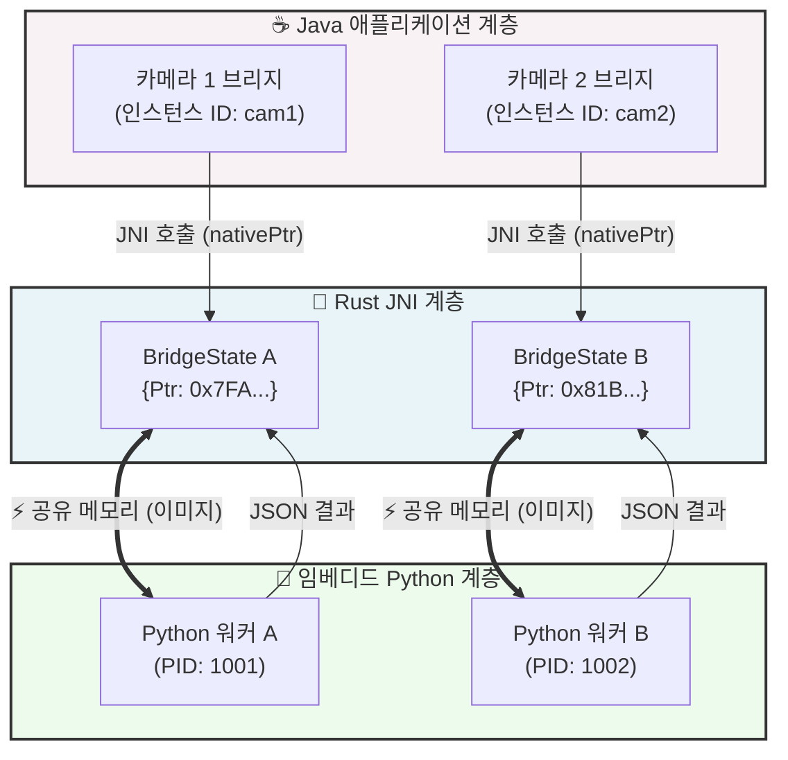
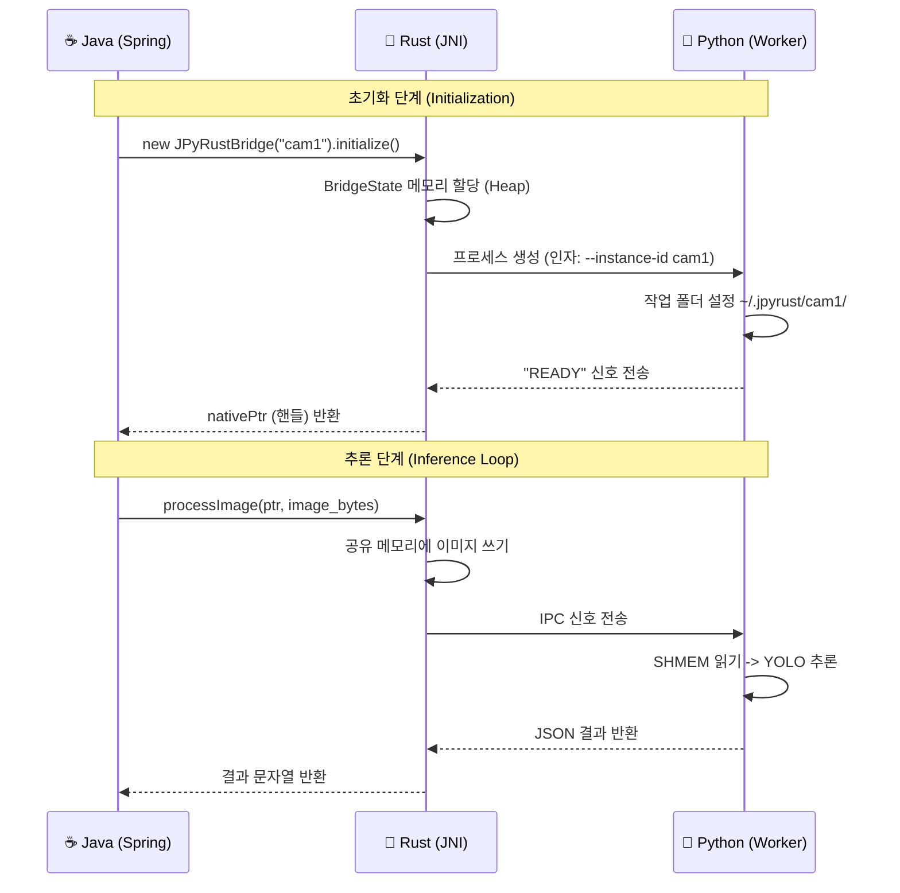

# 🚀 JPyRust: 고성능 유니버설 AI 브리지

> **"Java를 위한 궁극의 Python AI 통합 솔루션: 7초 지연 시간을 0.04초로 단축."**

[](https://github.com/farmer0010/JPyRust/actions)
[](https://jitpack.io/#farmer0010/JPyRust)
[](LICENSE)


<p align="center">
  <a href="https://openjdk.org/">
    
  </a>
  <a href="https://www.rust-lang.org/">
    
  </a>
  <a href="https://www.python.org/">
    
  </a>
</p>

<div align="center">
  <a href="README.md">🇺🇸 English Version</a>
</div>

---

## 💡 프로젝트 소개

**JPyRust**는 **Java의 견고함**과 **Python의 AI 생태계** 간의 격차를 해소하기 위해 설계된 하이브리드 아키텍처입니다. **Spring Boot** 애플리케이션이 **네이티브에 가까운 성능**으로 무거운 AI 모델(YOLO, PyTorch, TensorFlow)을 실행할 수 있게 해줍니다.

느린 `ProcessBuilder`나 지연 시간이 긴 HTTP API와 달리, JPyRust는 **Rust JNI**와 **공유 메모리(SHMEM)**를 활용하여 밀리초(ms) 단위 미만의 초고속 통신을 달성합니다.

### 🌟 왜 JPyRust인가요?
* 🚀 **Zero-Latency (지연 없음)**: 느린 HTTP/Socket 대신 시스템 RAM(공유 메모리)을 직접 사용하여 데이터 교환.
* 🔄 **완벽한 병렬성 (True Parallelism)**: v1.3.0부터 **멀티 인스턴스** 아키텍처를 지원하여, 하나의 Java 앱이 여러 개의 독립적인 Python 프로세스를 동시에 제어할 수 있습니다.
* 🛠️ **Zero-Config (설정 불필요)**: 격리된 **임베디드 Python 환경**을 자동으로 설치합니다. 복잡한 `pip install` 과정이 필요 없습니다.
* 🛡️ **Crash-Proof (충돌 방지)**: Rust가 Python 프로세스의 상태를 실시간 감시하며, 충돌 발생 시 즉시 워커를 자동 재시작합니다.

---

## 🏗️ 아키텍처 (v1.3.0)

**v1.3.0 업데이트**를 통해 JPyRust는 전역 싱글톤 패턴에서 벗어나 **멀티 인스턴스 객체 지향 아키텍처**로 완전히 전환되었습니다. 이를 통해 단일 Java 애플리케이션이 여러 개의 독립적인 AI 워커(예: 4채널 CCTV 동시 분석)를 효율적으로 제어할 수 있습니다.

### 🧩 시스템 컴포넌트 다이어그램



### ⚡ 실행 시퀀스 (Sequence)



---

## ⚡ 성능 벤치마크

| 아키텍처 | 통신 방식 | 지연 시간 (평균) | 처리량 | 안정성 |
| :--- | :--- | :---: | :---: | :---: |
| **CLI (ProcessBuilder)** | 표준 입출력 (Stdin/Out) | ~1,500ms | 🔴 낮음 | 🔴 낮음 (JVM 블로킹) |
| **HTTP (FastAPI/Flask)** | REST API | ~100ms | 🟡 보통 | 🟢 높음 |
| **JPyRust v1.3.0** | **공유 메모리 (SHMEM)** | **🟢 ~40ms** | **🟢 높음 (병렬 처리)** | **🟢 높음 (프로세스 격리)** |

> *테스트 환경: Ryzen 5 5600X, 32GB RAM, NVIDIA RTX 3060, YOLOv8n 모델*

---

## 🚀 빠른 시작 (Quick Start)

### 1. 설치 (Gradle)
`build.gradle.kts` 파일에 JitPack 리포지토리와 의존성을 추가하세요:

```kotlin
repositories {
    maven { url = uri("[https://jitpack.io](https://jitpack.io)") }
}

dependencies {
    // 최신 안정 버전
    implementation("com.github.farmer0010:JPyRust:v1.3.0")
}
```

### 2. 사용법 (Java)

**중요:** v1.3.0부터 `static` 메서드가 제거되었습니다. 반드시 `JPyRustBridge` 객체를 생성해야 합니다.

```java
import com.jpyrust.JPyRustBridge;

public class VisionService {
    
    public void startDetection() {
        // 1. 각 카메라를 위한 독립적인 인스턴스 생성
        JPyRustBridge cam1 = new JPyRustBridge("cam1");
        JPyRustBridge cam2 = new JPyRustBridge("cam2");

        // 2. 초기화 (각각 ~/.jpyrust/camX 경로에 워커 프로세스 생성)
        cam1.initialize(); 
        cam2.initialize(); 

        // 3. 이미지 처리 (스레드 안전)
        // 인자: (이미지데이터, 길이, 가로, 세로, 채널)
        byte[] result1 = cam1.processImage(imgData1, len1, 640, 480, 3);
        byte[] result2 = cam2.processImage(imgData2, len2, 640, 480, 3);
        
        System.out.println("Cam1 결과: " + new String(result1));
    }
}
```

---

## 🛠️ 설정 및 문제 해결 (Troubleshooting)

<details>
<summary><strong>🔧 1. UnsatisfiedLinkError / DLL을 찾을 수 없음</strong></summary>

* **원인:** Java가 네이티브 라이브러리(`dll`/`so`)를 찾지 못하는 경우입니다.
* **해결:** JPyRust는 라이브러리를 자동으로 `AppData/Local/Temp`에 추출합니다. 문제가 지속되면 `jpyrust.dll` (Windows) 또는 `libjpyrust.so` (Linux)가 라이브러리 경로에 있는지 확인하세요.
</details>

<details>
<summary><strong>🛡️ 2. WinError 5 (Access Denied)</strong></summary>

* **원인:** Windows의 공유 메모리 생성 시 보안 권한 문제입니다.
* **해결:** JPyRust v1.2+ 버전은 `SECURITY_ATTRIBUTES`와 SDDL `D:(A;;GA;;;WD)` 설정을 적용하여, 자식 프로세스가 권한 문제 없이 접근할 수 있도록 해결되었습니다. 별도 조치가 필요 없습니다.
</details>

<details>
<summary><strong>🐍 3. Python 의존성 문제</strong></summary>

* JPyRust는 **포터블 임베디드 Python**을 내장하고 있으며, `~/.jpyrust/python_dist`에 자동으로 설치됩니다.
* 라이브러리가 부족하다면 `resources` 폴더의 `requirements.txt`를 확인하세요.
</details>

---

## 📜 버전 히스토리

* **v1.3.0 (최신)** 🚀
    * **대규모 리팩토링:** 멀티 인스턴스(Multi-Instance) 아키텍처로 전환.
    * **Breaking Change:** Static 메서드 제거 및 생성자(`new`) 기반 초기화 도입.
    * **기능 추가:** 인스턴스별 작업 디렉토리 격리 (`~/.jpyrust/cam1`).

* **v1.2.0**
    * **성능:** Win32 API 직접 호출을 통해 Windows 환경에서 공유 메모리(SHMEM) 기능 복구.
    * **보안:** 커스텀 보안 기술자(Security Descriptor)를 적용하여 `WinError 5` 근본 해결.

* **v1.1.0**
    * 초기 Windows 지원 및 파일 기반 IPC 폴백 모드 추가.

---

## 📄 라이선스

이 프로젝트는 **MIT 라이선스**를 따릅니다. 자세한 내용은 [LICENSE](LICENSE) 파일을 참조하세요.

<div align="center">
  <sub>Built with 🦀 Rust & ☕ Java by Farmer0010 (JPyRust Team).</sub>
</div>
