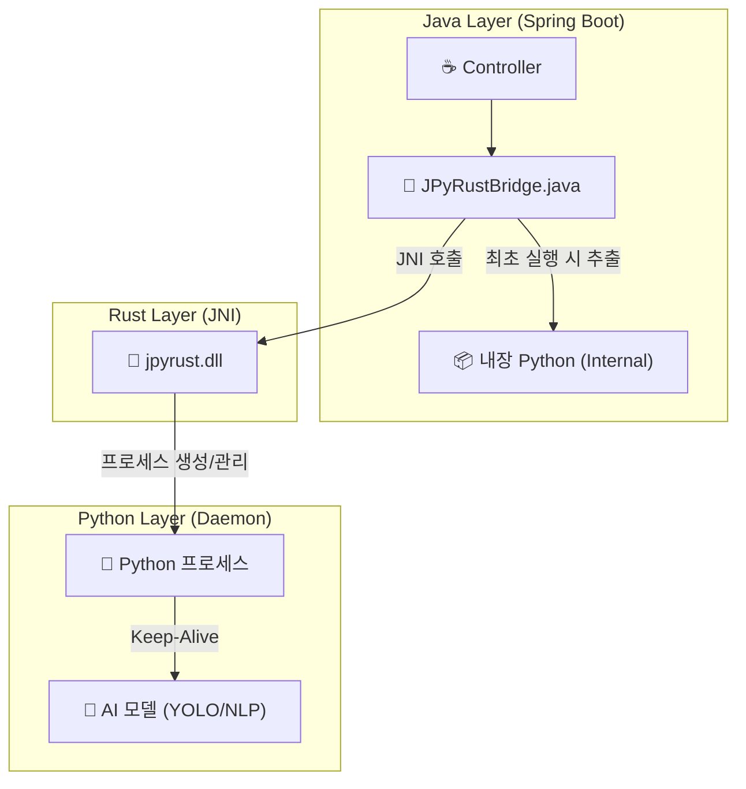

# 🚀 JPyRust: 고성능 유니버설 Java-Python AI 브리지

> **"Java를 위한 궁극의 Python AI 통합 솔루션: 레이턴시를 7초에서 0.009초로 단축"**

[](https://openjdk.org/)
[](https://www.rust-lang.org/)
[](https://www.python.org/)
[](LICENSE)

---

## 💡 소개

**JPyRust**는 **Spring Boot** 애플리케이션이 Python AI 모델(YOLO, PyTorch, TensorFlow 등)을 **오버헤드 없이 실시간으로** 실행할 수 있게 해주는 하이브리드 아키텍처입니다.

느린 `ProcessBuilder`나 복잡한 HTTP API 방식과 달리, **Rust JNI**와 **영속형 임베디드 Python 데몬(Persistent Embedded Python Daemon)**을 사용하여 네이티브에 가까운 속도를 보장합니다.

---

## ⚡ 성능 벤치마크 (Performance)

| 지표 | 기존 방식 (ProcessBuilder) | 🚀 JPyRust (데몬 방식) | 개선 효과 |
|------|:-------------------------:|:---------------------:|:---------:|
| **시작 오버헤드** | ~1,500ms (매번 Python VM 부팅) | **0ms** (항시 대기) | **무한대 (Infinite)** |
| **텍스트 분석 (NLP)** | ~7,000ms (모델 로딩 시간) | **9ms** (캐싱됨) | 🔥 **778배 빠름** |
| **영상 처리** | 0.1 FPS (사용 불가) | **10~30 FPS** | 🔥 **실시간 처리** |
| **데이터 안전성** | ❌ 경쟁 상태 (Race Conditions) | ✅ **UUID 격리** | **스레드 안전 (Thread-Safe)** |

---

## 🎯 지원 작업 및 기능

단순한 이미지 프로세서가 아닙니다. 어떤 Python 로직이든 실행할 수 있는 **유니버설 브리지(Universal Bridge)**입니다.

| 작업 | 엔드포인트 | 입/출력 | 설명 |
|------|------------|---------|------|
| 🔍 **객체 탐지** | `POST /api/ai/process-image` | 이미지 → JPEG (박스 포함) | CCTV, 웹캠 스트리밍 |
| 💬 **NLP 분석** | `POST /api/ai/text` | 텍스트 → JSON | 감정 분석, 챗봇 |
| 🏥 **헬스 체크** | `GET /api/ai/health` | - → JSON | 데몬 상태 모니터링 |

---

## 🏗️ 아키텍처

Java가 Rust를 통해 Python을 제어하는 3계층 아키텍처입니다.



1.  **Java Layer**: 웹 요청을 처리하고 고유 UUID를 생성하여 Rust를 호출합니다. 시작 시 내장된 Python 런타임을 **자동으로 추출**합니다.
2.  **Rust Layer**: 감독자(Supervisor) 역할을 수행하며(헬스 체크, I/O), 데이터를 안전하게 전달합니다.
3.  **Python Layer**: **임베디드 데몬**으로 실행되며, 요청 타입에 따라 작업을 분배(Dispatching)합니다.

---

## 🛠️ 통합 가이드 (Integration Guide)

JPyRust를 여러분의 Spring Boot 프로젝트에 추가하는 방법입니다.

### 1. 의존성 파일 복사

다음 파일들을 프로젝트로 복사하세요:

*   `rust-bridge/target/release/jpyrust.dll` (또는 `.so`) → 라이브러리 경로
*   `python-core/` → 스크립트 디렉토리 (`ai_worker.py` 포함)
*   `demo-web/src/main/java/com/jpyrust/JPyRustBridge.java` → Java 소스 경로 (`processText` 지원 버전 확인)

### 2. 컨트롤러 구현

마치 네이티브 Java 메서드처럼 Python 로직을 호출하세요.

```java
@RestController
public class MyAIController {

    // 브리지 주입
    private final JPyRustBridge bridge = new JPyRustBridge();

    @PostMapping("/analyze")
    public String analyzeText(@RequestBody String text) {
        // Python 작업 실행 (한 줄이면 끝!)
        // Rust를 통해 약 9ms 내에 결과 반환
        return bridge.processText(text); 
    }
}
```

### 3. 설정 (`application.yml`)

**Python을 별도로 설치할 필요가 없습니다!** 프로젝트에 내장된 Python 경로를 지정하기만 하면 됩니다.

```yaml
app:
  ai:
    work-dir: C:/jpyrust_temp        # 임시 파일 저장소 및 런타임 위치
    source-script-dir: d:/JPyRust/python-core # Python 스크립트 위치
```

> **작동 원리:**  
> `JPyRustBridge`는 `work-dir`에 Python이 없으면, JAR 파일 내에 내장된 `python_dist`를 자동으로 추출하여 즉시 실행 가능한 Python 환경을 구성합니다.

---

## 🚀 빠른 시작 (데모 실행)

### 필수 조건
*   **Java 17+**
*   *(선택 사항)* **Rust**: 네이티브 브리지를 수정하고 다시 빌드하고 싶은 경우에만 필요.

### 1. 빌드 및 실행

```bash
# 1. 저장소 복제
git clone https://github.com/your-org/JPyRust.git

# 2. Rust 브리지 빌드 (최초 1회)
cd rust-bridge && cargo build --release && cd ..

# 3. Java 서버 실행
./gradlew :demo-web:bootJar
java -jar demo-web/build/libs/demo-web-0.0.1-SNAPSHOT.jar
```

### 2. 테스트

*   **웹캠 데모**: 브라우저에서 `http://localhost:8080/video.html` 열기
*   **API 테스트**:
    ```bash
    curl -X POST -H "Content-Type: application/json" \
         -d '{"text":"This project is insanely fast!"}' \
         http://localhost:8080/api/ai/text
    ```

---

## 🔧 문제 해결 (Troubleshooting)

### Q. Python을 따로 설치해야 하나요?
**A. 아니요!** 이 프로젝트는 **임베디드 Python**을 사용하도록 설계되었습니다. Java가 시작될 때 JAR에서 자동으로 런타임 환경을 추출하여 설정합니다.

### Q. 'DLL not found' 에러가 발생합니다.
**A.** `jpyrust.dll` (Windows) 또는 `libjpyrust.so` (Linux/Mac) 파일이 `java.library.path`에 있는지 확인하세요. 데모 프로젝트는 이를 자동으로 로드합니다.

### Q. 사용자가 많아지면 느려지나요?
**A.** 현재 Python 데몬은 GIL 스레드 안전성을 위해 요청을 순차적으로 처리합니다. 하지만 처리 속도가 워낙 빨라(ms 단위), 적당한 트래픽에서는 지연을 느낄 수 없습니다. (멀티 워커 지원 예정)

---

## 🤝 기여하기

버그 제보와 기능 요청은 언제나 환영합니다! Pull Request를 보내주세요.

---

## 📄 라이선스

이 프로젝트는 MIT 라이선스를 따릅니다. 자유롭게 사용하고 수정하세요.

---

<p align="center">
  <b>Built with ☕ Java + 🦀 Rust + 🐍 Python</b><br>
  <i>성능의 삼위일체 (The Trinity of Performance).</i>
</p>
