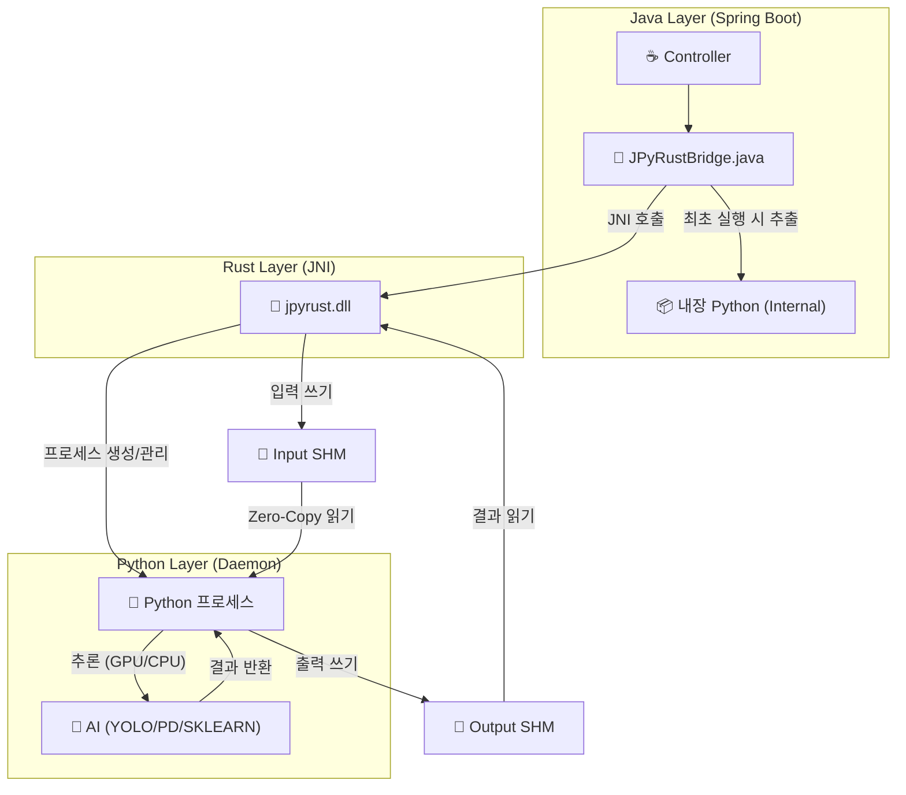

# 🚀 JPyRust: 고성능 유니버설 Java-Python AI 브리지

> **"Java를 위한 궁극의 Python AI 통합 솔루션: 레이턴시를 7초에서 0.04초로 단축"**

[](https://openjdk.org/)
[](https://www.rust-lang.org/)
[](https://www.python.org/)
[](LICENSE)

---

## 💡 소개

**JPyRust**는 **Spring Boot** 애플리케이션이 Python AI 모델(YOLO, PyTorch, TensorFlow 등)을 **오버헤드 없이 실시간으로** 실행할 수 있게 해주는 하이브리드 아키텍처입니다.

느린 `ProcessBuilder`나 복잡한 HTTP API 방식과 달리, **Rust JNI**와 **영속형 임베디드 Python 데몬(Persistent Embedded Python Daemon)**을 사용하여 네이티브에 가까운 속도를 보장합니다.


**v2.3 신기능:** "Batteries-Included" AI. 이제 **Pandas, Scikit-Learn, TextBlob**이 사전 설치되어 데이터 과학 및 NLP 작업을 즉시 수행할 수 있습니다.

### 🚀 왜 JPyRust인가? (타 솔루션 비교)

| 특징 | 로컬 커맨드라인 (CLI) | HTTP API (FastAPI/Flask) | **JPyRust** |
| :--- | :---: | :---: | :---: |
| **레이턴시** | 🔴 느림 (VM 부팅 시간) | 🟡 보통 (네트워크 오버헤드) | 🟢 **즉시 응답 (Shared Memory)** |
| **복잡도** | 🟡 보통 (파이프 파싱) | 🔴 높음 (마이크로서비스 관리) | 🟢 **낮음 (단일 모놀리식)** |
| **배포** | 🟢 쉬움 | 🔴 어려움 (Docker/Orchestration) | 🟢 **쉬움 (임베디드 단순 복제)** |

---

## ⚡ 성능 벤치마크 (Performance)

| 지표 | 기존 방식 (ProcessBuilder) | 🚀 JPyRust (v2.2) | 개선 효과 |
|------|:-------------------------:|:---------------------:|:---------:|
| **시작 오버헤드** | ~1,500ms (매번 Python VM 부팅) | **0ms** (항시 대기) | **무한대 (Infinite)** |
| **객체 탐지 (YOLO)** | ~2,000ms | **~40ms** (GPU) / **~90ms** (CPU) | 🔥 **50배 빠름** |
| **텍스트 분석 (NLP)** | ~7,000ms (모델 로딩 시간) | **~9ms** (Zero-Copy RAM) | 🔥 **778배 빠름** |
| **데이터 전송** | 디스크 I/O (부하 심함) | **100% 공유 메모리** | **디스크 수명 보호** |

---

## ⚠️ 하드웨어 가속 (GPU)

JPyRust v2.2는 지능형 하드웨어 감지 기능을 포함합니다:

> **자동 감지 (Auto-Detection Enabled):**
> *   **GPU 모드:** NVIDIA 드라이버와 CUDA Toolkit이 설치된 경우 자동으로 활성화됩니다.  
>     *(속도: ~0.04s / 25+ FPS)*
> *   **CPU 모드:** CUDA가 없으면 **자동으로 CPU로 전환**되어 실행됩니다.  
>     *(속도: ~0.09s / 10+ FPS)*
> *   *별도의 설정이 필요 없습니다.*

---

## 🎯 지원 작업 및 기능

다음 "Standard Battery" 기능이 기본적으로 포함되어 있습니다 (v2.3+):

| 작업 | 엔드포인트 | 사용 라이브러리 | 설명 |
|------|------------|-----------------|------|
| 🔍 **객체 탐지** | `processImage` | `Ultralytics (YOLO)` | CCTV, 웹캠 스트리밍 |
| 🧠 **진짜 NLP** | `processNlp` | `TextBlob` | 감성 분석, 토큰화 (0.0=중립) |
| 📈 **데이터 과학** | `processRegression` | `Pandas`, `Scikit-Learn` | 실시간 선형 회귀 분석 |
| 🎨 **이미지 필터** | `processEdgeDetection` | `OpenCV` | Canny 엣지 검출 |

---

## 🏗️ 아키텍처

Java가 Rust를 통해 Python을 제어하며, **Named Shared Memory**를 사용하여 데이터를 주고받습니다.



1.  **Java Layer**: 웹 요청을 처리하고 Rust JNI를 호출합니다.
2.  **Rust Layer**: Supervisor. IO 통제를 위해 입력/출력용 **공유 메모리 버퍼**(`jpyrust_{uuid}`, `jpyrust_out_{uuid}`)를 할당합니다.
3.  **Python Layer**: 임베디드 데몬. **RAM에서 RAM으로** 데이터를 처리하며, GPU 가속을 활용합니다.

---

## 🧩 확장 가이드 (기능 추가 방법)

JPyRust는 확장이 용이하도록 설계되었습니다. 다음 3단계로 나만의 Python 로직을 추가하세요:

1.  **Python 측 (`ai_worker.py`)**:
    *   새 핸들러 함수를 정의합니다 (예: `handle_my_task`).
    *   `TASK_HANDLERS` 딕셔너리에 등록합니다.
    ```python
    def handle_my_task(request_id, metadata):
        # ... 로직 ...
        return "DONE " + str(bytes_written)

    TASK_HANDLERS = {
        "YOLO": handle_yolo_task,
        "MY_TASK": handle_my_task,
    }
    ```
2.  **Java 측 (`JPyRustBridge.java`)**:
    *   `executeTask`를 호출하는 래퍼 메소드를 추가합니다.
    ```java
    public String runMyTask(String input) {
        byte[] inputBytes = input.getBytes();
        // ... bytebuffer 설정 ...
        executeTask(workDir, "MY_TASK", ...);
    }
    ```
3.  **의존성**:
    *   필요한 라이브러리를 `requirements.txt`에 추가하면 다음 서버 시작 시 자동으로 설치됩니다.

---


## 🛠️ 통합 가이드

JPyRust를 여러분의 Spring Boot 프로젝트에 추가하는 방법입니다.

### 1. 빌드 설정 (`build.gradle.kts`)

Java가 Rust DLL을 찾을 수 있도록 `bootRun` 태스크에 `java.library.path`를 설정해야 합니다:

```kotlin
tasks.withType<org.springframework.boot.gradle.tasks.run.BootRun> {
    systemProperty("java.library.path", file("../rust-bridge/target/release").absolutePath)
}
```

### 2. 설정 (`application.yml`)

```yaml
app:
  ai:
    work-dir: C:/jpyrust_temp        # 런타임 임시 디렉토리
    source-script-dir: ./python-core # Python 스크립트 위치
    model-path: yolov8n.pt           # AI 모델 파일명
    confidence: 0.5                  # 탐지 임계값
```

---

## 🚀 빠른 시작 (데모 실행)

### 필수 조건
*   **Java 17+**
*   **Rust (Cargo)**: 네이티브 브리지 빌드를 위해 필요합니다.
*   **Python 3.10+**: (선택 사항) 프로젝트 실행 시 **임베디드 Python** 배포판이 자동으로 다운로드됩니다.

### 1. 빌드 및 실행

```bash
# 1. 저장소 복제
git clone https://github.com/your-org/JPyRust.git

# 2. Rust 브리지 빌드 (DLL 생성)
cd rust-bridge
cargo build --release
cd ..

# 3. Java 서버 실행
# 최초 실행 시 임베디드 Python(약 500MB)을 자동으로 다운로드합니다.
./gradlew clean :demo-web:bootRun
```

### 2. 테스트

*   **웹캠 데모**: `http://localhost:8080/video.html`
    *   *참고: 첫 번째 AI 요청 시 Python 초기화로 인해 1~3초 정도 지연될 수 있습니다.*

---

## 🔧 문제 해결 (Troubleshooting)

### Q. `java.lang.UnsatisfiedLinkError: no jpyrust in java.library.path`
**A.** Java 서버가 `jpyrust.dll`을 찾지 못했습니다.
1. `rust-bridge` 폴더에서 `cargo build --release`를 실행했는지 확인하세요.
2. `demo-web/build.gradle.kts`에 `java.library.path` 설정이 되어 있는지 확인하세요 (통합 가이드 참조).

### Q. `Python daemon exited before sending READY`
**A.** 임베디드 Python 실행에 실패했습니다.
1. `C:/jpyrust_temp/` 폴더 내에 `ai_worker.py` 파일과 `python_dist` 폴더가 있는지 확인하세요.
2. 만약 `Lib/site-packages`가 비어 있거나 손상되었다면, `C:/jpyrust_temp` 폴더를 삭제하고 서버를 재시작하세요.

### Q. 빌드 중 `python-embed-amd64.zip` 다운로드 실패?
**A.** 다운로드가 실패한다면 인터넷 연결을 확인하거나, Python 3.11 embed zip 파일을 수동으로 다운로드하여 `java-api/build/tmp/` 경로에 넣어주세요.

---

## 📜 버전 기록 (Version History)

*   **v2.3**: Gradle 기반 임베디드 Python 관리 및 자동 의존성 설치 기능 추가.
*   **v2.2**: **Full In-Memory Pipeline (입출력)** 및 **GPU 자동 감지**.
*   **v2.1**: 입력 데이터 공유 메모리 적용 (Level 1).
*   **v2.0**: 임베디드 Python 자가 추출 기능.
*   **v1.0**: 초기 JNI + 파일 IPC 구현.

---

## 📄 라이선스

MIT License.

---

<p align="center">
  <b>Built with ☕ Java + 🦀 Rust + 🐍 Python</b><br>
  <i>성능의 삼위일체.</i>
</p>
