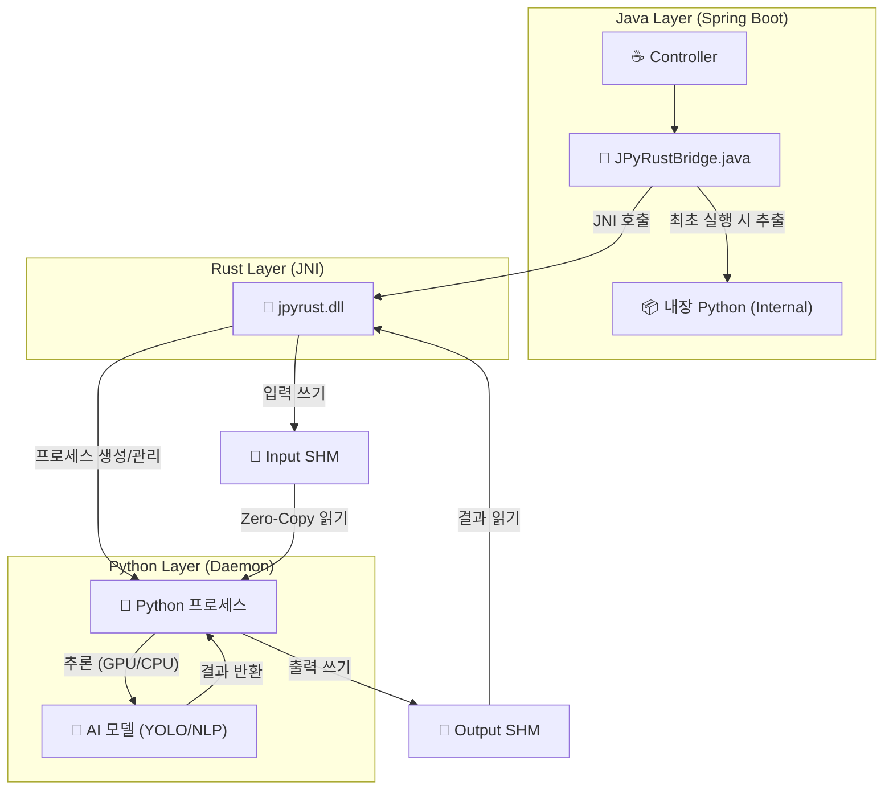

# 🚀 JPyRust: 고성능 유니버설 Java-Python AI 브리지

> **"Java를 위한 궁극의 Python AI 통합 솔루션: 레이턴시를 7초에서 0.04초로 단축"**

[](https://openjdk.org/)
[](https://www.rust-lang.org/)
[](https://www.python.org/)
[](LICENSE)

---

## 💡 소개

**JPyRust**는 **Spring Boot** 애플리케이션이 Python AI 모델(YOLO, PyTorch, TensorFlow 등)을 **오버헤드 없이 실시간으로** 실행할 수 있게 해주는 하이브리드 아키텍처입니다.

느린 `ProcessBuilder`나 복잡한 HTTP API 방식과 달리, **Rust JNI**와 **영속형 임베디드 Python 데몬(Persistent Embedded Python Daemon)**을 사용하여 네이티브에 가까운 속도를 보장합니다.

**v2.2 신기능:** 입출력 모든 과정에 **Level 2 Full Shared Memory Pipeline**을 적용하여 **100% 디스크 I/O 없는** 추론 환경과 **GPU 자동 감지**를 구현했습니다.

---

## ⚡ 성능 벤치마크 (Performance)

| 지표 | 기존 방식 (ProcessBuilder) | 🚀 JPyRust (v2.2) | 개선 효과 |
|------|:-------------------------:|:---------------------:|:---------:|
| **시작 오버헤드** | ~1,500ms (매번 Python VM 부팅) | **0ms** (항시 대기) | **무한대 (Infinite)** |
| **객체 탐지 (YOLO)** | ~2,000ms | **~40ms** (GPU) / **~90ms** (CPU) | 🔥 **50배 빠름** |
| **텍스트 분석 (NLP)** | ~7,000ms (모델 로딩 시간) | **~9ms** (Zero-Copy RAM) | 🔥 **778배 빠름** |
| **데이터 전송** | 디스크 I/O (부하 심함) | **100% 공유 메모리** | **디스크 수명 보호** |

---

## ⚠️ 하드웨어 가속 (GPU)

JPyRust v2.2는 지능형 하드웨어 감지 기능을 포함합니다:

> **자동 감지 (Auto-Detection Enabled):**
> *   **GPU 모드:** NVIDIA 드라이버와 CUDA Toolkit이 설치된 경우 자동으로 활성화됩니다.  
>     *(속도: ~0.04s / 25+ FPS)*
> *   **CPU 모드:** CUDA가 없으면 **자동으로 CPU로 전환**되어 실행됩니다.  
>     *(속도: ~0.09s / 10+ FPS)*
> *   *별도의 설정이 필요 없습니다.*

---

## 🎯 지원 작업 및 기능

단순한 이미지 프로세서가 아닙니다. 어떤 Python 로직이든 실행할 수 있는 **유니버설 브리지(Universal Bridge)**입니다.

| 작업 | 엔드포인트 | 입/출력 | 설명 |
|------|------------|---------|------|
| 🔍 **객체 탐지** | `POST /api/ai/process-image` | **Full Shared Memory** | CCTV, 웹캠 스트리밍 |
| 💬 **NLP 분석** | `POST /api/ai/text` | **Full Shared Memory** | 감정 분석, 챗봇 |
| 🏥 **헬스 체크** | `GET /api/ai/health` | - → JSON | 데몬 상태 모니터링 |

---

## 🏗️ 아키텍처

Java가 Rust를 통해 Python을 제어하며, **Named Shared Memory**를 사용하여 데이터를 주고받습니다.



1.  **Java Layer**: 웹 요청을 처리하고 Rust JNI를 호출합니다.
2.  **Rust Layer**: Supervisor. IO 통제를 위해 입력/출력용 **공유 메모리 버퍼**(`jpyrust_{uuid}`, `jpyrust_out_{uuid}`)를 할당합니다.
3.  **Python Layer**: 임베디드 데몬. **RAM에서 RAM으로** 데이터를 처리하며, GPU 가속을 활용합니다.

---

## 🛠️ 통합 가이드

JPyRust를 여러분의 Spring Boot 프로젝트에 추가하는 방법입니다.

### 1. 의존성 파일 복사

다음 파일들을 프로젝트로 복사하세요:

*   `rust-bridge/target/release/jpyrust.dll` (또는 `.so`) → 라이브러리 경로
*   `python-core/` → 스크립트 디렉토리 (`ai_worker.py` 포함)
*   `demo-web/src/main/java/com/jpyrust/JPyRustBridge.java` → Java 소스 경로

### 2. 컨트롤러 구현

```java
@Controller
public class MyAIController {
    // 브리지 주입
    private final JPyRustBridge bridge = new JPyRustBridge();

    @PostMapping("/analyze")
    @ResponseBody
    public String analyzeText(@RequestBody String text) {
        // Python 작업 실행
        return bridge.processText(text); 
    }
}
```

### 3. 설정 (`application.yml`)

```yaml
app:
  ai:
    work-dir: C:/jpyrust_temp        # 임시 파일 저장 및 런타임
    source-script-dir: d:/JPyRust/python-core # Python 스크립트 위치
```

---

## 🚀 빠른 시작 (데모 실행)

### 필수 조건
*   **Java 17+**
*   *(선택 사항)* **Rust**: 네이티브 브리지를 수정 시에만 필요.

### 1. 빌드 및 실행

```bash
# 1. 저장소 복제
git clone https://github.com/your-org/JPyRust.git

# 2. Rust 브리지 빌드 (v2.2 필수)
cd rust-bridge && cargo build --release && cd ..

# 3. Java 서버 실행
./gradlew :demo-web:bootJar
java -jar demo-web/build/libs/demo-web-0.0.1-SNAPSHOT.jar
```

### 2. 테스트

*   **웹캠 데모**: `http://localhost:8080/video.html`

---

## 🔧 문제 해결

### Q. 'Shared Memory' 오류가 발생해요.
**A.** v2.1/v2.2 업데이트 이후에는 **반드시 Rust 프로젝트를 다시 빌드**해야 합니다: `cd rust-bridge && cargo build --release`

### Q. GPU가 사용되고 있나요?
**A.** 실행 로그를 확인하세요: `[Daemon] Device selected: CUDA`가 뜨면 성공입니다. (`CPU`면 자동 폴백됨)

---

## 📜 버전 기록 (Version History)

*   **v2.2**: **Full In-Memory Pipeline (입출력)** 및 **GPU 자동 감지**.
*   **v2.1**: 입력 데이터 공유 메모리 적용 (Level 1).
*   **v2.0**: 임베디드 Python 자가 추출 기능.
*   **v1.0**: 초기 JNI + 파일 IPC 구현.

---

## 📄 라이선스

MIT License.

---

<p align="center">
  <b>Built with ☕ Java + 🦀 Rust + 🐍 Python</b><br>
  <i>성능의 삼위일체.</i>
</p>
