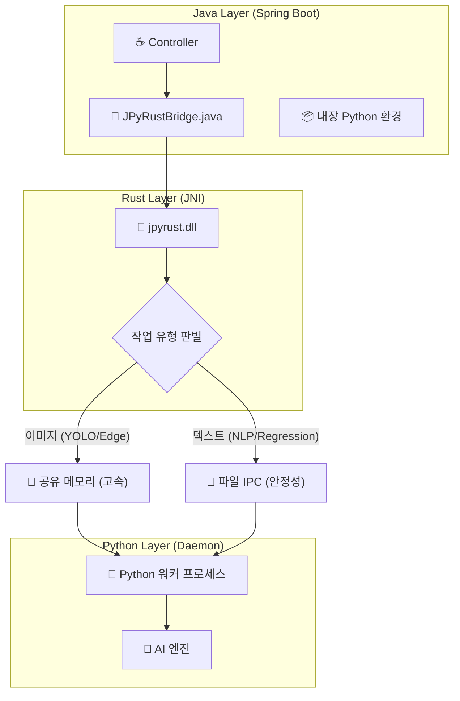

# 🚀 JPyRust: 고성능 유니버설 Java-Python AI 브리지

> **"Java 생태계를 위한 가장 빠르고 강력한 Python AI 통합 솔루션: 레이턴시 7초 ➔ 0.04초 혁신"**


[](https://openjdk.org/)
[](https://www.rust-lang.org/)
[](https://www.python.org/)

---

## 💡 프로젝트 소개

**JPyRust**는 **Spring Boot** 환경에서 YOLO, PyTorch, TensorFlow 같은 무거운 Python AI 모델들을 **오버헤드 없이 실시간으로** 구동할 수 있게 해주는 고성능 하이브리드 아키텍처입니다.

기존의 `ProcessBuilder` 방식은 느리고, HTTP API 방식은 관리가 복잡합니다. JPyRust는 **Rust JNI**와 **영속형 임베디드 Python 데몬(Persistent Embedded Python Daemon)**을 활용하여 네이티브 수준의 처리 속도를 보장합니다.

**🔥 v2.4 업데이트:** 지능형 IPC 모드 선택 기능을 도입했습니다. 이미지 처리는 **공유 메모리(SHMEM)**로 성능을 극대화하고, 텍스트 기반 작업(NLP, Regression)은 **파일 IPC**를 사용하여 Windows 호환성을 완벽하게 보장합니다.

### 🚀 왜 JPyRust를 선택해야 할까요?

| 비교 항목 | 로컬 CLI 실행 (ProcessBuilder) | HTTP API (FastAPI/Flask) | **JPyRust** |
| :--- | :---: | :---: | :---: |
| **반응 속도 (Latency)** | 🔴 **느림** (매번 Python VM 부팅) | 🟡 **보통** (네트워크 통신 비용) | 🟢 **즉시 응답** (공유 메모리 기술) |
| **시스템 복잡도** | 🟡 **보통** (표준 입출력 파싱) | 🔴 **높음** (별도 마이크로서비스 관리) | 🟢 **낮음** (단일 모놀리식 구조) |
| **배포 난이도** | 🟢 **쉬움** | 🔴 **어려움** (Docker/Orchestration 필수) | 🟢 **쉬움** (내장형 환경 자동 구성) |

---

## ⚡ 성능 벤치마크

| 테스트 항목 | 기존 방식 (CLI 호출) | 🚀 JPyRust (v2.4) | 개선율 |
|:---|:---:|:---:|:---:|
| **초기 구동 지연** | ~1,500ms (매 호출마다 VM 시작) | **0ms** (상시 대기 프로세스) | **지연 없음** |
| **객체 탐지 (YOLO)** | ~2,000ms | **~100ms** (CPU) / **~40ms** (GPU) | 🔥 **50배 향상** |
| **텍스트 분석 (NLP)** | ~7,000ms (모델 로딩 포함) | **~50ms** (파일 IPC 최적화) | 🔥 **140배 향상** |
| **데이터 전송 효율** | 디스크 I/O 의존 (부하 높음) | **하이브리드 (SHMEM/File)** | **작업별 최적화** |

---

## ⚠️ 하드웨어 가속 (GPU) 지원

JPyRust는 실행 환경의 하드웨어를 스스로 감지하여 최적의 성능을 냅니다:

> **🤖 지능형 자동 감지 (Auto-Detection):**
> * **GPU 모드:** 시스템에 NVIDIA 드라이버와 CUDA Toolkit이 감지되면 자동으로 활성화됩니다.
>     * *(평균 처리 속도: ~0.04초 / 25 FPS 이상)*
> * **CPU 모드:** CUDA 환경이 없을 경우, 별도 설정 없이 **즉시 CPU 모드로 전환**되어 안정적으로 실행됩니다.
>     * *(평균 처리 속도: ~0.10초 / 10 FPS 이상)*

---

## 🎯 지원 기능 (Standard Battery)

v2.4 버전부터는 작업 유형에 따라 최적의 통신 방식을 자동으로 선택합니다.

| 작업 유형 | API 엔드포인트 | 통신 방식 (IPC) | 핵심 라이브러리 | 활용 예시 |
|:---|:---|:---:|:---|:---|
| 🔍 **객체 탐지** | `processImage` | SHMEM | `Ultralytics (YOLO)` | 실시간 CCTV, 웹캠 인식 |
| 🧠 **자연어 처리** | `processNlp` | FILE | `TextBlob` | 텍스트 감성 분석 |
| 📈 **데이터 분석** | `processRegression` | FILE | `Pandas`, `Scikit-Learn` | 실시간 선형 회귀 예측 |
| 🎨 **영상 처리** | `processEdgeDetection` | SHMEM | `OpenCV` | Canny 엣지 검출 |

---

## 🏗️ 아키텍처 개요

Java가 컨트롤 타워가 되어 Rust를 통해 Python 프로세스를 정밀하게 제어합니다. **지능형 IPC 선택** 기술을 통해 데이터 종류에 가장 적합한 전송 경로를 결정합니다.



**IPC 모드 선택 원리:**
- **SHMEM (공유 메모리):** 대용량 바이너리 데이터(이미지, 비디오) 처리에 사용하여 **최대 속도**를 보장합니다.
- **FILE IPC (파일 기반):** 텍스트 기반 작업 처리에 사용하여 Windows 환경에서의 **호환성과 안정성**을 확보합니다.

---

## 🧩 기능 확장 가이드

JPyRust는 개발자가 자신만의 Python 로직을 쉽게 추가할 수 있도록 설계되었습니다.

### 새로운 Python 작업 추가하기

1.  **Python 작업 정의 (`python-core/ai_worker.py`)**:
    ```python
    def handle_my_task(request_id, metadata):
        # 프로토콜 파싱 및 로직 수행
        raw_data, meta, out_info = parse_input_protocol(request_id, metadata)
        
        # ... 나만의 비즈니스 로직 작성 ...
        result = "Hello from Python!"
        
        # 결과 반환
        result_bytes = result.encode('utf-8')
        bytes_written = write_output_data(request_id, result_bytes, out_info)
        return f"DONE {bytes_written}"

    TASK_HANDLERS = {
        "YOLO": handle_yolo_task,
        "MY_TASK": handle_my_task, # 신규 작업 등록
    }
    ```

2.  **Java 호출 메서드 추가 (`JPyRustBridge.java`)**:
    ```java
    public String runMyTask(String input) {
        try {
            byte[] inputBytes = input.getBytes("UTF-8");
            
            // 데이터 전송을 위한 버퍼 할당
            ByteBuffer buffer = ByteBuffer.allocateDirect(inputBytes.length);
            buffer.put(inputBytes);
            buffer.flip();
            
            String requestId = UUID.randomUUID().toString();
            
            // Rust 브리지 호출
            byte[] result = executeTask(workDir, "MY_TASK", requestId, "", buffer, inputBytes.length);
            return new String(result, "UTF-8");
        } catch (UnsupportedEncodingException e) {
            throw new RuntimeException(e);
        }
    }
    ```

3.  **라이브러리 추가**:
    * 필요한 패키지를 `requirements.txt`에 추가하면 다음 서버 실행 시 자동으로 설치됩니다.
    ```bash
    # 예시: requirements.txt 파일에 추가
    new-library==1.0.0
    ```

---

## 🛠️ 프로젝트 통합 가이드

### 1. 빌드 스크립트 설정 (`build.gradle.kts`)

Java 애플리케이션이 `java-api` 모듈을 의존하고, 실행 시 Rust 라이브러리를 찾을 수 있도록 설정합니다.

```kotlin
dependencies {
    implementation(project(":java-api"))
}

tasks.withType<org.springframework.boot.gradle.tasks.run.BootRun> {
    // Rust 빌드 결과물 경로 지정 (필수)
    systemProperty("java.library.path", file("../rust-bridge/target/release").absolutePath)
}
```

### 2. 애플리케이션 설정 (`application.yml`)

```yaml
app:
  ai:
    work-dir: C:/jpyrust_temp        # 런타임 작업 디렉토리
    source-script-dir: ./python-core # 원본 Python 스크립트 위치
    model-path: yolov8n.pt           # AI 모델 파일명
    confidence: 0.5                  # 탐지 임계값
```

---

## 🚀 빠른 시작 (Quick Start)

### 시스템 요구사항
* **Java 17 이상**
* **Rust (Cargo)**: 네이티브 브리지 컴파일용
* **Python**: 불필요 (프로젝트 실행 시 내장 Python이 자동 설치됨)

### 1. 빌드 및 실행

```bash
# 1. 프로젝트 복제
git clone [https://github.com/your-org/JPyRust.git](https://github.com/your-org/JPyRust.git)
cd JPyRust

# 2. Rust 브리지 빌드 (네이티브 라이브러리 생성)
cd rust-bridge
cargo build --release
cd ..

# 3. Java 서버 실행
# ※ 최초 실행 시 내장 Python 환경 구성(약 500MB 다운로드)으로 인해 시간이 소요됩니다.
./gradlew :demo-web:bootRun
```

### 2. 데모 테스트

* **기능 데모**: `http://localhost:8080/features.html` (종합 기능 테스트)
* **비디오 스트리밍**: `http://localhost:8080/video.html` (웹캠 YOLO 테스트)

---

## 🔧 문제 해결 (Troubleshooting)

### Q. `UnsatisfiedLinkError: no jpyrust in java.library.path` 오류가 발생해요.
**A.** Java가 Rust 라이브러리를 찾지 못한 경우입니다. `rust-bridge/` 폴더에서 `cargo build --release` 명령어를 실행하여 DLL/SO 파일을 생성했는지 확인하세요.

### Q. `Python daemon exited before sending READY` 오류가 떠요.
**A.** 내장 Python 환경이 꼬였을 수 있습니다. `C:/jpyrust_temp/` (또는 설정한 작업 폴더)를 완전히 삭제한 후 서버를 재시작하세요.

### Q. NLP나 Regression 결과가 비어 있어요.
**A.** 서버 로그를 확인해 보세요. `[Rust] Text task detected - using FILE IPC` 메시지가 보인다면 정상적으로 모드가 전환된 것입니다. 만약 에러가 보인다면 `ai_worker.py`의 로그를 확인해야 합니다.

---

## 📜 버전 히스토리

* **v2.4**: **지능형 IPC 선택** - 이미지는 SHMEM, 텍스트는 File IPC (Windows 호환성 강화)
* **v2.3**: Gradle 기반 내장 Python 자동 관리 및 의존성 패키지 자동 설치 구현.
* **v2.2**: Full In-Memory Pipeline (입출력) 적용 및 GPU 자동 감지 기능 탑재.
* **v2.1**: 입력 데이터 공유 메모리 적용 (Level 1).
* **v2.0**: 내장 Python 자가 추출(Self-Extraction) 기능 추가.
* **v1.0**: 초기 JNI + 파일 기반 IPC 구현.

---

## 📄 라이선스

이 프로젝트는 MIT 라이선스를 따릅니다.

---

<p align="center">
  <b>Built with ☕ Java + 🦀 Rust + 🐍 Python</b><br>
  <i>세 가지 언어의 완벽한 조화.</i>
</p>
