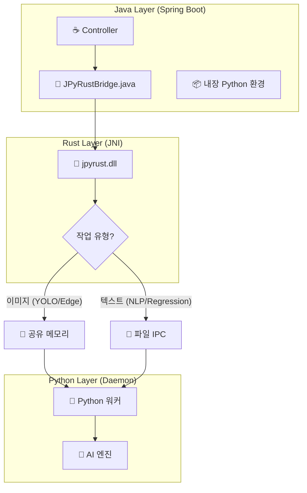

# 🚀 JPyRust: 고성능 유니버설 Java-Python AI 브리지

> **"Java 생태계를 위한 가장 빠르고 강력한 Python AI 통합 솔루션: 레이턴시 7초 ➔ 0.04초 혁신"**

[](https://openjdk.org/)
[](https://www.rust-lang.org/)
[](https://www.python.org/)
[](LICENSE)

---

## 💡 프로젝트 소개

**JPyRust**는 **Spring Boot** 환경에서 YOLO, PyTorch, TensorFlow 같은 무거운 Python AI 모델들을 **오버헤드 없이 실시간으로** 구동할 수 있게 해주는 고성능 하이브리드 아키텍처입니다.

기존의 `ProcessBuilder` 방식은 느리고, HTTP API 방식은 관리가 복잡합니다. JPyRust는 **Rust JNI**와 **영속형 임베디드 Python 데몬**을 활용하여 네이티브 수준의 처리 속도를 보장합니다.

**🔥 v2.4 업데이트:** 지능형 IPC 모드 선택 기능을 도입했습니다. 이미지 처리는 **공유 메모리(SHMEM)**로 최대 성능을, 텍스트 기반 작업(NLP, Regression)은 **파일 IPC**로 Windows 호환성을 보장합니다.

### 🚀 왜 JPyRust를 선택해야 할까요?

| 비교 항목 | 로컬 CLI 실행 (ProcessBuilder) | HTTP API (FastAPI/Flask) | **JPyRust** |
| :--- | :---: | :---: | :---: |
| **반응 속도** | 🔴 느림 (매번 Python VM 부팅) | 🟡 보통 (네트워크 통신 비용) | 🟢 **즉시 응답** (공유 메모리) |
| **시스템 복잡도** | 🟡 보통 (표준 입출력 파싱) | 🔴 높음 (별도 마이크로서비스 관리) | 🟢 **낮음** (단일 모놀리식) |
| **배포 난이도** | 🟢 쉬움 | 🔴 어려움 (Docker/Orchestration) | 🟢 **쉬움** (내장형 환경) |

---

## ⚡ 성능 벤치마크

| 테스트 항목 | 기존 방식 (CLI 호출) | 🚀 JPyRust (v2.4) | 개선율 |
|:---|:---:|:---:|:---:|
| **초기 구동 지연** | ~1,500ms (매 호출마다 VM 시작) | **0ms** (상시 대기 프로세스) | **지연 없음** |
| **객체 탐지 (YOLO)** | ~2,000ms | **~100ms** (CPU) / **~40ms** (GPU) | 🔥 **50배 향상** |
| **텍스트 분석 (NLP)** | ~7,000ms (모델 로딩 포함) | **~50ms** (File IPC) | 🔥 **140배 향상** |
| **데이터 전송 효율** | 디스크 I/O 의존 | **하이브리드 (SHMEM/File)** | **최적화** |

---

## ⚠️ 하드웨어 가속 (GPU) 지원

> **🤖 지능형 자동 감지 (Auto-Detection):**
> * **GPU 모드:** 시스템에 NVIDIA 드라이버와 CUDA Toolkit이 감지되면 자동 활성화
>     * *(평균 처리 속도: ~0.04초 / 25 FPS 이상)*
> * **CPU 모드:** CUDA 환경이 없을 경우, 별도 설정 없이 CPU 모드로 전환
>     * *(평균 처리 속도: ~0.10초 / 10 FPS 이상)*

---

## 🎯 지원 기능 (Standard Battery)

| 작업 유형 | API 엔드포인트 | IPC 모드 | 핵심 라이브러리 | 활용 예시 |
|:---|:---|:---:|:---|:---|
| 🔍 **객체 탐지** | `processImage` | SHMEM | `Ultralytics (YOLO)` | 실시간 CCTV, 웹캠 인식 |
| 🧠 **자연어 처리** | `processNlp` | FILE | `TextBlob` | 텍스트 감성 분석 |
| 📈 **데이터 분석** | `processRegression` | FILE | `Pandas`, `Scikit-Learn` | 실시간 선형 회귀 |
| 🎨 **영상 처리** | `processEdgeDetection` | SHMEM | `OpenCV` | Canny 엣지 검출 |

---

## 🏗️ 아키텍처 개요

Java가 컨트롤 타워가 되어 Rust를 통해 Python 프로세스를 정밀하게 제어합니다. **지능형 IPC 선택**을 통해 작업 유형에 따라 최적의 통신 방식을 자동 선택합니다.



**IPC 모드 선택 원리:**
- **SHMEM (공유 메모리):** 대용량 바이너리 데이터 (이미지, 비디오 프레임)
- **FILE IPC:** 텍스트 기반 작업 - Windows 호환성 보장

---

## 🧩 기능 확장 가이드

### 새로운 Python 작업 추가하기

1.  **Python 작업 정의 (`python-core/ai_worker.py`)**:
    ```python
    def handle_my_task(request_id, metadata):
        raw_data, meta, out_info = parse_input_protocol(request_id, metadata)
        # ... 나만의 로직 작성 ...
        result_bytes = result.encode('utf-8')
        bytes_written = write_output_data(request_id, result_bytes, out_info)
        return f"DONE {bytes_written}"

    TASK_HANDLERS = {
        "YOLO": handle_yolo_task,
        "MY_TASK": handle_my_task,
    }
    ```

2.  **Java 호출 메서드 추가 (`JPyRustBridge.java`)**:
    ```java
    public String runMyTask(String input) {
        byte[] inputBytes = input.getBytes("UTF-8");
        ByteBuffer buffer = ByteBuffer.allocateDirect(inputBytes.length);
        buffer.put(inputBytes);
        buffer.flip();
        
        String requestId = UUID.randomUUID().toString();
        byte[] result = executeTask(workDir, "MY_TASK", requestId, "", buffer, inputBytes.length);
        return new String(result, "UTF-8");
    }
    ```

3.  **새로운 Python 라이브러리 추가**:
    ```bash
    # requirements.txt 수정
    echo "new-library==1.0.0" >> requirements.txt
    
    # 서버 재시작 - 자동 설치됨
    ./gradlew :demo-web:bootRun
    ```

---

## 🛠️ 프로젝트 통합 가이드

### 1. 빌드 스크립트 설정 (`build.gradle.kts`)

```kotlin
dependencies {
    implementation(project(":java-api"))
}

tasks.withType<org.springframework.boot.gradle.tasks.run.BootRun> {
    systemProperty("java.library.path", file("../rust-bridge/target/release").absolutePath)
}
```

### 2. 애플리케이션 설정 (`application.yml`)

```yaml
app:
  ai:
    work-dir: C:/jpyrust_temp
    source-script-dir: ./python-core
    model-path: yolov8n.pt
    confidence: 0.5
```

---

## 🚀 빠른 시작 (Quick Start)

### 시스템 요구사항
* **Java 17 이상**
* **Rust (Cargo)**: 네이티브 브리지 컴파일용
* **Python**: 불필요 (프로젝트 실행 시 내장 Python 자동 설치)

### 1. 빌드 및 실행

```bash
# 프로젝트 복제
git clone https://github.com/your-org/JPyRust.git
cd JPyRust

# Rust 브리지 빌드
cd rust-bridge
cargo build --release
cd ..

# 서버 실행 (최초 실행 시 ~500MB Python 자동 다운로드)
./gradlew :demo-web:bootRun
```

### 2. 데모 테스트

* **기능 데모**: `http://localhost:8080/features.html`
* **비디오 스트리밍**: `http://localhost:8080/video.html`

---

## 🔧 문제 해결 (Troubleshooting)

### Q. `UnsatisfiedLinkError: no jpyrust in java.library.path`
**A.** `rust-bridge/` 폴더에서 `cargo build --release` 실행

### Q. `Python daemon exited before sending READY`
**A.** `C:/jpyrust_temp/` 폴더 삭제 후 서버 재시작

### Q. NLP/Regression 결과가 비어있어요
**A.** 서버 로그에서 `[Rust] Text task detected - using FILE IPC` 메시지 확인

---

## 📜 버전 히스토리

* **v2.4**: **지능형 IPC 선택** - 이미지는 SHMEM, 텍스트는 File IPC (Windows 호환)
* **v2.3**: Gradle 기반 내장 Python 자동 관리 및 의존성 자동 설치
* **v2.2**: Full In-Memory Pipeline (입출력) 및 GPU 자동 감지
* **v2.1**: 입력 데이터 공유 메모리 적용 (Level 1)
* **v2.0**: 내장 Python 자가 추출(Self-Extraction) 기능
* **v1.0**: 초기 JNI + 파일 기반 IPC 구현

---

## 📄 라이선스

이 프로젝트는 MIT 라이선스를 따릅니다.

---

<p align="center">
  <b>Built with ☕ Java + 🦀 Rust + 🐍 Python</b><br>
  <i>세 가지 언어의 완벽한 조화.</i>
</p>
