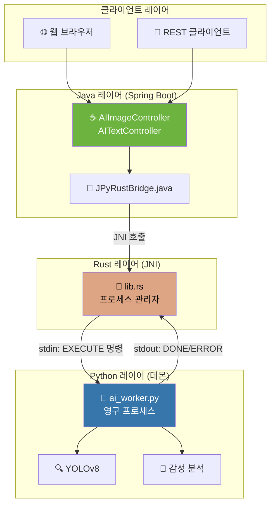

# 🚀 JPyRust: 유니버설 Java-Python AI 브릿지

> **"하나의 데몬. 다양한 AI 태스크. 밀리초 지연시간."**

[](https://openjdk.org/)
[](https://www.rust-lang.org/)
[](https://www.python.org/)
[](LICENSE)

[🇺🇸 English Version](README.md)

---

## ⚡ 성능 한눈에 보기

| 지표 | Before (v1.x) | After (v2.0) | 개선율 |
|------|:-------------:|:------------:|:------:|
| **텍스트 분석** | 7,000ms | **9ms** | 🔥 **778배 빠름** |
| **비디오 프레임** | 7,000ms | **60-100ms** | 🔥 **70-116배 빠름** |
| **첫 번째 요청** | 7,000ms | 7,000ms | _(모델 로딩)_ |
| **동시성** | ❌ Race condition | ✅ UUID 격리 | 스레드 세이프 |

> 비결은? **데몬 모드** - Python이 모델을 메모리에 미리 로드한 상태로 대기합니다.

---

## 🎯 지원 AI 태스크

| 태스크 | 엔드포인트 | 입력 | 출력 | 지연시간 |
|--------|------------|------|------|----------|
| 🔍 **객체 인식** | `POST /api/ai/process-image` | 이미지 (JPEG/PNG) | 바운딩 박스가 그려진 JPEG | ~60-100ms |
| 💬 **감성 분석** | `POST /api/ai/text` | JSON `{"text": "..."}` | 감성 분석 결과 | ~9ms |
| 🏥 **헬스 체크** | `GET /api/ai/health` | - | 상태 JSON | <1ms |

---

## 🏗️ 아키텍처



### 핵심 설계 결정

| 컴포넌트 | 기술 | 이유 |
|----------|------|------|
| **IPC** | stdin/stdout | 단순함, 디버깅 용이, 소켓 불필요 |
| **파일 전송** | `input_{uuid}.dat` | UUID 격리로 동시성 안전 |
| **모델 로딩** | 시작 시 1회 | 요청당 6초 오버헤드 제거 |
| **출력 포맷** | JPEG (Python 인코딩) | Java 재인코딩 불필요 |

---

## 📡 IPC 프로토콜

Rust 브릿지는 간단한 텍스트 프로토콜로 Python과 통신합니다:

```plaintext
# 명령 형식
EXECUTE <task_type> <request_id> <metadata...>

# 예시
EXECUTE YOLO a1b2c3d4-e5f6-7890-abcd-ef1234567890 640 480 3
EXECUTE SENTIMENT b2c3d4e5-f6a7-8901-bcde-f12345678901 NONE

# 응답
READY              # 데몬 초기화 완료
DONE 5             # 성공 (5개 객체 감지)
ERROR <message>    # 실패
```

---

## 🚀 빠른 시작

### 사전 요구사항
- Java 17+ (JDK)
- Rust (Cargo) - 네이티브 브릿지 빌드용
- Python 3.10+ with pip

### 1. 클론 & 빌드

```bash
# 저장소 클론
git clone https://github.com/your-org/JPyRust.git
cd JPyRust

# Rust 브릿지 빌드
cd rust-bridge
cargo build --release
cd ..

# Python 의존성 설치
pip install ultralytics opencv-python numpy

# Java 애플리케이션 빌드
./gradlew :demo-web:bootJar
```

### 2. 설정

`demo-web/src/main/resources/application.yml` 편집:
```yaml
app:
  ai:
    work-dir: C:/jpyrust_temp        # 임시 파일 디렉터리
    source-script-dir: d:/JPyRust/python-core  # Python 스크립트
```

### 3. 실행

```bash
java -jar demo-web/build/libs/demo-web-0.0.1-SNAPSHOT.jar
```

### 4. API 테스트

```bash
# 헬스 체크
curl http://localhost:8080/api/ai/health

# 객체 인식 (이미지)
curl -X POST -F "file=@test.jpg" http://localhost:8080/api/ai/process-image -o result.jpg

# 감성 분석 (텍스트)
curl -X POST -H "Content-Type: application/json" \
  -d '{"text":"이 제품 정말 좋아요!"}' \
  http://localhost:8080/api/ai/text

# 응답: {"sentiment":"POSITIVE (confidence: 0.60)","input_length":12,"processing_time_ms":9}
```

### 5. 실시간 비디오 데모

브라우저에서 열기: `http://localhost:8080/video.html`

- 📷 웹캠 기반 객체 인식
- 📊 실시간 FPS 카운터
- 🎯 CPU에서 YOLOv8으로 2-5 FPS

---

## 📂 프로젝트 구조

```plaintext
JPyRust/
├── demo-web/                    # Spring Boot 애플리케이션
│   └── src/main/java/com/jpyrust/
│       ├── demo/
│       │   ├── AIImageController.java   # 이미지 처리 엔드포인트
│       │   └── AITextController.java    # 텍스트 분석 엔드포인트
│       └── JPyRustBridge.java           # JNI 브릿지 인터페이스
├── rust-bridge/                 # Rust JNI 구현체
│   └── src/lib.rs               # 데몬 관리자 & IPC 핸들러
├── python-core/                 # Python AI 워커
│   └── ai_worker.py             # 태스크 디스패칭 유니버설 데몬
├── application.yml              # 설정
└── README.md                    # 지금 보고 계신 문서!
```

---

## 📜 버전 히스토리

| 버전 | 마일스톤 | 주요 성과 |
|------|----------|-----------|
| **v0.1** | PoC | 기본 Java-Rust-Python JNI 파이프라인 |
| **v0.2** | Zero-Config | DLL 자동 추출 NativeLoader |
| **v0.3** | Standalone | 내장 Python 3.10 런타임 |
| **v1.0** | Release | Spring Boot + Docker 지원 |
| **v1.1** | Zero-Copy | 공유 메모리 이미지 처리 |
| **v2.0** | **Universal Bridge** | 🎉 데몬 모드, 멀티 태스크, UUID 격리, 778배 속도 향상 |

---

## 🔧 문제 해결

### ❌ Python 경로를 찾을 수 없음
```
Error: Failed to spawn Python daemon: The system cannot find the file specified
```
**해결방법:** `python.exe`가 작업 디렉터리에 있는지 확인하거나 `application.yml`의 `work-dir`을 업데이트하세요.

### ❌ 포트 8080이 이미 사용 중
```
Web server failed to start. Port 8080 was already in use.
```
**해결방법:** 기존 프로세스를 종료하거나 포트를 변경하세요:
```bash
# Windows
netstat -ano | findstr :8080
taskkill /PID <pid> /F

# 또는 application.yml에서 포트 변경
server:
  port: 8081
```

### ❌ 웹캠 권한 거부
```
NotAllowedError: Permission denied
```
**해결방법:** 
1. HTTPS 사용 (localhost는 보통 허용됨)
2. 브라우저의 카메라 접근 권한 확인
3. 다른 앱이 웹캠을 사용 중인지 확인

### ❌ YOLO 모델을 찾을 수 없음
```
Error: yolov8n.pt not found
```
**해결방법:** 모델은 첫 실행 시 자동 다운로드됩니다. 인터넷 연결을 확인하거나 `yolov8n.pt`를 작업 디렉터리에 직접 배치하세요.

---

## 🤝 기여하기

1. 저장소 포크
2. 기능 브랜치 생성: `git checkout -b feature/amazing-feature`
3. 변경사항 커밋: `git commit -m 'Add amazing feature'`
4. 브랜치에 푸시: `git push origin feature/amazing-feature`
5. Pull Request 열기

---

## 📄 라이선스

이 프로젝트는 MIT 라이선스 하에 있습니다 - 자세한 내용은 [LICENSE](LICENSE) 파일을 참조하세요.

---

<p align="center">
  <b>☕ Java + 🦀 Rust + 🐍 Python 으로 빌드됨</b><br>
  <i>성능의 삼위일체.</i>
</p>
