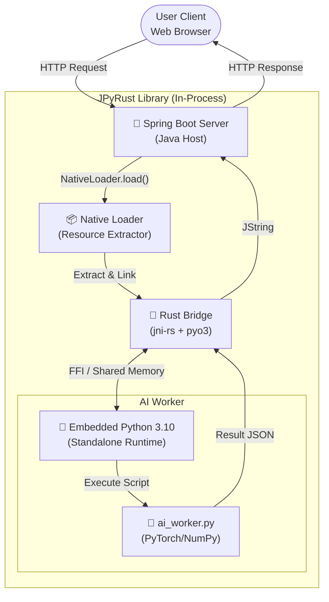
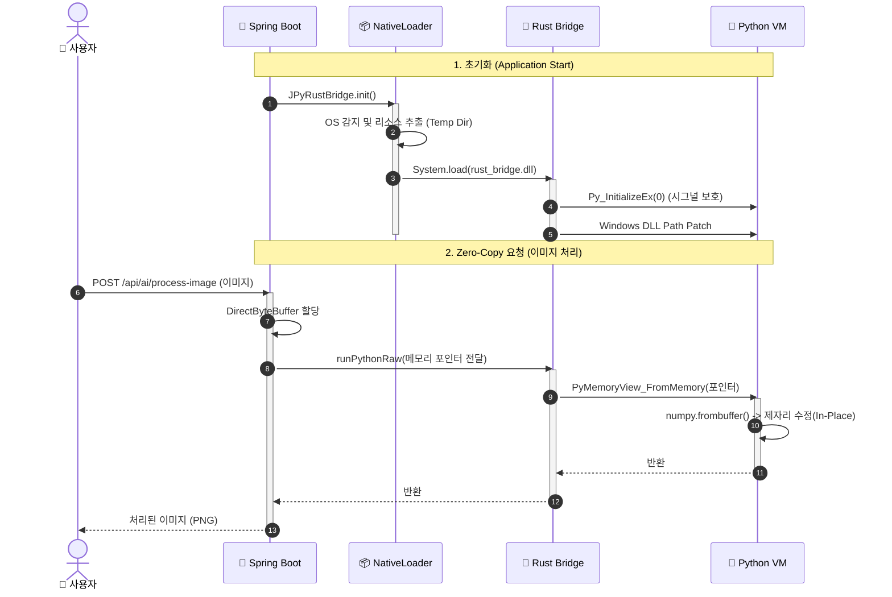

# 🌉 JPyRust: Zero-Config Java-Python Bridge

> "Stop asking users to install Python."

[🇺🇸 English Version](README.md)

---

## 🏗️ System Architecture (시스템 아키텍처)
**Polyglot Runtime Environment**
Java(Host), Rust(Bridge), Python(Worker)이 하나의 프로세스 메모리를 공유하며 동작합니다.



<br>

## 🚀 Key Features (핵심 기능)

### 1. 📦 Zero-Config Deployment (무설정 배포)
- **Standalone Runtime**: 사용자의 PC에 Python이 설치되어 있지 않아도 됩니다. JAR 파일 내부에 최적화된 **Python 3.10 런타임(ZIP)**을 내장하고 있습니다.
- **Smart NativeLoader**: 앱 실행 시 OS(Windows/Linux/Mac)를 감지하여, 필요한 DLL/SO 파일과 Python 런타임을 임시 디렉터리로 자동 추출하고 로드합니다.

### 2. 🛡️ Memory Safety & Stability (안전성)
- **Rust Safety Valve**: C/C++ 기반 JNI(JEP 등)와 달리, Rust의 소유권 모델을 통해 메모리 누수와 포인터 오류(SegFault)를 원천 차단합니다.
- **Signal Handling Protection**: Python 인터프리터가 JVM의 시그널 핸들러(SIGINT, SIGSEGV)를 덮어쓰지 않도록 저수준(Py_InitializeEx)에서 제어하여 JVM 비정상 종료를 방지합니다.

### 3. ⚡ High Performance (고성능)
- **No ProcessBuilder**: 느린 프로세스 포크(ProcessBuilder)나 HTTP 통신 대신, **JNI(Java Native Interface)**를 통해 메모리 공간을 공유합니다.
- **GIL Management**: Rust 레벨에서 Python의 GIL(Global Interpreter Lock) 획득/해제를 명시적으로 관리하여, 멀티스레드 환경(Spring Boot)에서도 데드락(Deadlock) 없는 안정적인 동시성을 제공합니다.

### 4. ⚡ Zero-Copy Shared Memory (초고속 데이터 통신)
- **Direct ByteBuffer**: Java의 Off-Heap 메모리를 Rust와 Python이 복사 없이 직접 공유합니다. (이론상 전송 속도 0ms)
- **In-Place Modification**: Python (`numpy`/`cv2`)에서 Java 메모리에 있는 이미지 데이터를 직접 수정하여 반환합니다. 대용량 AI 모델 추론 시 직렬화 오버헤드를 완벽하게 제거했습니다.

### 5. 🛠️ Development Experience (개발자 경험)
- **Dependency Automation**: `requirements.txt`에 패키지명만 적으면, Gradle 빌드 시 자동으로 `pip install`을 수행하고 JAR에 내장합니다.
- **CI/CD Pipeline**: GitHub Actions를 통해 Windows, Linux, macOS용 네이티브 라이브러리를 자동으로 크로스 빌드하고 배포합니다.

## 📂 Project Structure (프로젝트 구조)
**Multi-Module Polyglot Project**
Java, Rust, Python, Web 코드가 유기적으로 결합된 구조입니다.

```plaintext
.
├── architecture.md             # [Doc] 아키텍처 설계 문서
├── docker-compose.yml          # [Infra] Docker 배포 설정
├── Dockerfile                  # [Infra] Multi-stage 빌드 스크립트
├── settings.gradle.kts         # [Gradle] 멀티 모듈 설정
├── requirements.txt            # [Config] Python 의존성 관리
├── java-api                    # [Module] Java 라이브러리 (Core)
│   ├── src/main/java
│   │   └── com/jpyrust
│   │       ├── NativeLoader.java   # [Core] DLL 및 Python 런타임 자동 추출기
│   │       └── JPyRustBridge.java  # [API] 사용자 제공 Native Interface
│   └── src/main/resources
│       └── python_dist         # [Res] 내장 Python 런타임 (빌드 시 Zip 압축)
├── rust-bridge                 # [Module] Rust JNI 구현체
│   ├── Cargo.toml              # [Rust] jni, pyo3 의존성 정의
│   └── src
│       └── lib.rs              # [Code] JNI 함수 구현 및 Python VM 제어 로직
├── python-core                 # [Module] AI/ML 로직
│   └── ai_worker.py            # [Code] 실제 연산을 수행하는 Python 스크립트
└── demo-web                    # [Module] Spring Boot 예제 서버
    └── src/main/java/.../AIImageController.java # Zero-Copy API 엔드포인트
```

## 🔄 Logic Flow (실행 흐름도)
웹 요청이 들어왔을 때, Java에서 Rust를 거쳐 Python AI가 실행되는 과정입니다.



## 📜 Version History (개발 연혁)

| 버전 | 단계 | 주요 성과 |
| :--- | :--- | :--- |
| **v0.1** | PoC | Java-Rust-Python 기본 통신 파이프라인(JNI Pipeline) 구축 성공 |
| **v0.2** | Zero-Config | NativeLoader 구현. `-Djava.library.path` 옵션 제거 및 자동 로딩 성공 |
| **v0.3** | Desert Mode | Standalone Python(3.10) 내장. 로컬 Python 설치 없이 실행 가능 구현 |
| **v0.4** | Safety Patch | SIGINT 충돌 방지 및 Windows DLL 경로 문제 해결 (안정성 확보) |
| **v1.0** | Release | Spring Boot 연동 및 Docker 멀티 스테이지 빌드 지원. 최종 배포 버전 |
| **v1.1** | Optimization | Zero-Copy Shared Memory 통신 구현 & 이미지 처리 데모 추가 |
| **v1.2** | Automation | Gradle 기반 Python 의존성 자동 관리 & GitHub Actions CI/CD 구축 |

---

## ⚙️ Setup & Run (실행 방법)

### 1. Prerequisites (준비물)
- Java 17+ (JDK)
- Rust (Cargo, 소스 빌드 시에만 필요)
- Docker (컨테이너 실행 시 권장)

### 2. Run with Gradle (로컬 실행)

```bash
# 1. Rust 라이브러리 빌드 (Release 모드)
cd rust-bridge
cargo build --release

# 2. 리소스 복사 (자동화 가능)
# (이미 natives 폴더에 dll/so 파일이 있다면 건너뛰세요)

# 3. Spring Boot 데모 실행
cd ../demo-web
./gradlew bootRun
```
  * Chat API 테스트: `http://localhost:8080/api/ai/chat?message=HelloJPyRust&id=1`

### 3. Run with Docker (추천)
Docker를 사용하면 로컬에 Python이나 Rust 설정이 없어도 깔끔하게 실행할 수 있습니다.

```bash
# Docker 이미지 빌드 및 실행
docker build -t jpyrust-demo .
docker run -p 8080:8080 jpyrust-demo
```

### 4. Zero-Copy Image Processing Demo
웹 브라우저에서 Zero-Copy 성능을 직접 체험해보세요.

1. 서버 실행: `./gradlew bootRun`
2. 접속: `http://localhost:8080`
3. 기능:
   - 이미지 업로드 및 실시간 흑백/반전 처리
   - **Zero-Copy Processing Time** 확인 가능 (콘솔 로그)
