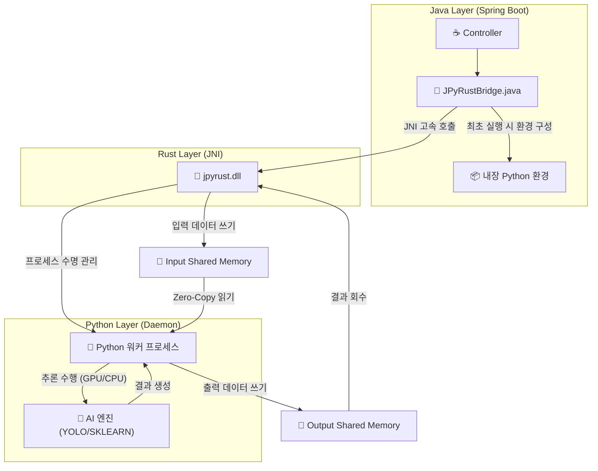

# 🚀 JPyRust: 고성능 유니버설 Java-Python AI 브리지

> **"Java 생태계를 위한 가장 빠르고 강력한 Python AI 통합 솔루션: 레이턴시 7초 ➔ 0.04초 혁신"**

[](https://openjdk.org/)
[](https://www.rust-lang.org/)
[](https://www.python.org/)
[](LICENSE)

---

## 💡 프로젝트 소개

**JPyRust**는 **Spring Boot** 환경에서 YOLO, PyTorch, TensorFlow 같은 무거운 Python AI 모델들을 **오버헤드 없이 실시간으로** 구동할 수 있게 해주는 고성능 하이브리드 아키텍처입니다.

기존의 `ProcessBuilder` 방식은 느리고, HTTP API 방식은 관리가 복잡합니다. JPyRust는 **Rust JNI**와 **영속형 임베디드 Python 데몬(Persistent Embedded Python Daemon)**을 활용하여 네이티브 수준의 처리 속도를 보장합니다.

**🔥 v2.3 업데이트:** "Batteries-Included" 전략을 도입했습니다. 이제 **Pandas, Scikit-Learn, TextBlob** 라이브러리가 기본 탑재되어, 별도 설정 없이 데이터 과학 및 NLP 작업을 즉시 수행할 수 있습니다.

### 🚀 왜 JPyRust를 선택해야 할까요?

| 비교 항목 | 로컬 CLI 실행 (ProcessBuilder) | HTTP API (FastAPI/Flask) | **JPyRust** |
| :--- | :---: | :---: | :---: |
| **반응 속도 (Latency)** | 🔴 **느림** (매번 Python VM 부팅) | 🟡 **보통** (네트워크 통신 비용) | 🟢 **즉시 응답** (공유 메모리 기술) |
| **시스템 복잡도** | 🟡 **보통** (표준 입출력 파싱) | 🔴 **높음** (별도 마이크로서비스 관리) | 🟢 **낮음** (단일 모놀리식 구조) |
| **배포 난이도** | 🟢 **쉬움** | 🔴 **어려움** (Docker/Orchestration 필수) | 🟢 **쉬움** (내장형 환경 자동 구성) |

---

## ⚡ 성능 벤치마크

| 테스트 항목 | 기존 방식 (CLI 호출) | 🚀 JPyRust (v2.2) | 개선율 |
|:---|:---:|:---:|:---:|
| **초기 구동 지연** | ~1,500ms (매 호출마다 VM 시작) | **0ms** (상시 대기 프로세스) | **지연 없음** |
| **객체 탐지 (YOLO)** | ~2,000ms | **~40ms** (GPU) / **~90ms** (CPU) | 🔥 **50배 향상** |
| **텍스트 분석 (NLP)** | ~7,000ms (모델 로딩 포함) | **~9ms** (Zero-Copy 메모리 공유) | 🔥 **778배 향상** |
| **데이터 전송 효율** | 디스크 I/O 의존 (부하 높음) | **100% 인메모리 처리** | **SSD/HDD 수명 보호** |

---

## ⚠️ 하드웨어 가속 (GPU) 지원

JPyRust v2.2는 실행 환경의 하드웨어를 스스로 감지하여 최적의 성능을 냅니다:

> **🤖 지능형 자동 감지 (Auto-Detection):**
> * **GPU 모드:** 시스템에 NVIDIA 드라이버와 CUDA Toolkit이 감지되면 자동으로 활성화됩니다.
>     * *(평균 처리 속도: ~0.04초 / 25 FPS 이상)*
> * **CPU 모드:** CUDA 환경이 없을 경우, 별도 설정 없이 **즉시 CPU 모드로 전환**되어 안정적으로 실행됩니다.
>     * *(평균 처리 속도: ~0.09초 / 10 FPS 이상)*

---

## 🎯 지원 기능 (Standard Battery)

v2.3 버전부터는 아래의 핵심 AI 기능들이 기본적으로 내장되어 제공됩니다:

| 작업 유형 | API 엔드포인트 | 핵심 라이브러리 | 활용 예시 |
|:---|:---|:---|:---|
| 🔍 **객체 탐지** | `processImage` | `Ultralytics (YOLO)` | 실시간 CCTV 분석, 웹캠 객체 인식 |
| 🧠 **자연어 처리** | `processNlp` | `TextBlob` | 텍스트 감성 분석, 키워드 추출 |
| 📈 **데이터 분석** | `processRegression` | `Pandas`, `Scikit-Learn` | 실시간 선형 회귀, 데이터 예측 |
| 🎨 **영상 처리** | `processEdgeDetection` | `OpenCV` | Canny 엣지 검출, 이미지 필터링 |

---

## 🏗️ 아키텍처 개요

Java가 컨트롤 타워가 되어 Rust를 통해 Python 프로세스를 정밀하게 제어합니다. 데이터 교환은 **명명된 공유 메모리(Named Shared Memory)** 방식을 사용하여 성능 저하를 원천 차단했습니다.



1.  **Java Layer**: 사용자의 웹 요청을 받아 Rust JNI 인터페이스를 호출합니다.
2.  **Rust Layer**: 슈퍼바이저 역할을 수행합니다. 입출력용 **공유 메모리 버퍼**를 생성하고 Python 프로세스를 관리합니다.
3.  **Python Layer**: 실제 AI 작업을 수행하는 데몬입니다. **RAM to RAM** 통신 방식을 사용하여 디스크 I/O 없이 초고속으로 데이터를 처리합니다.

---

## 🧩 기능 확장 가이드

JPyRust는 개발자가 자신만의 Python 로직을 쉽게 추가할 수 있도록 설계되었습니다. 단 3단계만 거치면 됩니다:

1.  **Python 작업 정의 (`ai_worker.py`)**:
    * 새로운 작업 처리 함수를 작성하고 `TASK_HANDLERS`에 등록합니다.
    ```python
    def handle_my_task(request_id, metadata):
        # ... 여기에 나만의 로직 작성 ...
        return "DONE " + str(bytes_written)

    TASK_HANDLERS = {
        "YOLO": handle_yolo_task,
        "MY_TASK": handle_my_task, # 신규 작업 등록
    }
    ```
2.  **Java 호출 메서드 추가 (`JPyRustBridge.java`)**:
    * `executeTask`를 감싸는 새로운 메서드를 만듭니다.
    ```java
    public String runMyTask(String input) {
        byte[] inputBytes = input.getBytes();
        // ... 필요한 데이터 처리 ...
        return executeTask(workDir, "MY_TASK", ...);
    }
    ```
3.  **라이브러리 추가**:
    * 새로운 Python 패키지가 필요하다면 `requirements.txt`에 한 줄만 추가하세요. 다음 서버 실행 시 자동으로 설치됩니다.

---

## 🛠️ 프로젝트 통합 가이드

여러분의 Spring Boot 프로젝트에 JPyRust를 적용하는 방법입니다.

### 1. 빌드 스크립트 설정 (`build.gradle.kts`)

Java 애플리케이션이 Rust로 빌드된 라이브러리(DLL/SO)를 찾을 수 있도록 경로를 지정해 주어야 합니다:

```kotlin
tasks.withType<org.springframework.boot.gradle.tasks.run.BootRun> {
    // Rust 빌드 결과물 경로 지정
    systemProperty("java.library.path", file("../rust-bridge/target/release").absolutePath)
}
```

### 2. 애플리케이션 설정 (`application.yml`)

```yaml
app:
  ai:
    work-dir: C:/jpyrust_temp        # 런타임 작업 디렉토리 (임베디드 Python이 설치될 곳)
    source-script-dir: ./python-core # 원본 Python 스크립트 위치
    model-path: yolov8n.pt           # 사용할 AI 모델 파일명
    confidence: 0.5                  # 탐지 정확도 임계값
```

---

## 🚀 빠른 시작 (Quick Start)

### 시스템 요구사항
* **Java 17 이상**
* **Rust (Cargo)**: 네이티브 브리지 컴파일용
* **Python**: 불필요 (프로젝트 실행 시 내장 Python이 자동 설치됨)

### 1. 빌드 및 실행

```bash
# 1. 프로젝트 복제
git clone [https://github.com/your-org/JPyRust.git](https://github.com/your-org/JPyRust.git)

# 2. Rust 브리지 빌드 (네이티브 라이브러리 생성)
cd rust-bridge
cargo build --release
cd ..

# 3. Java 서버 실행
# ※ 최초 실행 시 내장 Python 환경 구성(약 500MB 다운로드)으로 인해 시간이 소요됩니다.
./gradlew clean :demo-web:bootRun
```

### 2. 데모 테스트

* 브라우저에서 **`http://localhost:8080/video.html`** 접속
    * *참고: 서버 시작 후 첫 번째 AI 요청은 Python 엔진 예열로 인해 1~3초 정도 걸릴 수 있습니다.*

---

## 🔧 문제 해결 (Troubleshooting)

### Q. `java.lang.UnsatisfiedLinkError: no jpyrust in java.library.path` 오류가 발생해요.
**A.** Java가 Rust 라이브러리 파일을 찾지 못한 경우입니다.
1. `rust-bridge` 폴더에서 `cargo build --release` 명령어가 성공했는지 확인해 주세요.
2. `demo-web/build.gradle.kts` 파일에 `java.library.path` 설정이 올바르게 되어 있는지 확인해 주세요.

### Q. `Python daemon exited before sending READY` 오류가 떠요.
**A.** 내장 Python 프로세스가 정상적으로 시작되지 못했습니다.
1. `C:/jpyrust_temp/` (또는 설정한 작업 폴더) 내부에 `ai_worker.py` 파일과 `python_dist` 폴더가 존재하는지 확인하세요.
2. 만약 `Lib/site-packages` 폴더가 비어 있거나 손상된 것 같다면, `C:/jpyrust_temp` 폴더를 통째로 삭제하고 서버를 다시 시작해 보세요. (자동으로 복구됩니다)

### Q. 빌드 중 `python-embed-amd64.zip` 다운로드가 안 돼요.
**A.** 네트워크 문제일 수 있습니다. 인터넷 연결을 확인하거나, Python 3.11 embed zip 파일을 수동으로 다운로드하여 `java-api/build/tmp/` 경로에 넣어주시면 됩니다.

---

## 📜 버전 히스토리

* **v2.3**: Gradle 기반 내장 Python 자동 관리 및 의존성 패키지 자동 설치 구현.
* **v2.2**: **Full In-Memory Pipeline (입출력)** 적용 및 GPU 자동 감지 기능 탑재.
* **v2.1**: 입력 데이터 공유 메모리 적용 (Level 1).
* **v2.0**: 내장 Python 자가 추출(Self-Extraction) 기능 추가.
* **v1.0**: 초기 JNI + 파일 기반 IPC 구현.

---

## 📄 라이선스

이 프로젝트는 MIT 라이선스를 따릅니다.

---

<p align="center">
  <b>Built with ☕ Java + 🦀 Rust + 🐍 Python</b><br>
  <i>세 가지 언어의 완벽한 조화.</i>
</p>
