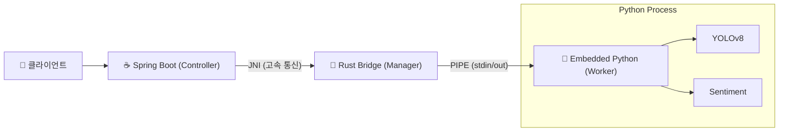

# 🚀 JPyRust: 초고속 Java-Python 유니버설 AI 브릿지

> **"Java 개발자를 위한 Python AI 통합 솔루션: 7초의 로딩을 0.009초로 단축하다."**

[](https://openjdk.org/)
[](https://www.rust-lang.org/)
[](https://www.python.org/)
[](LICENSE)

[🇺🇸 English Version](README.md)

---

## 💡 프로젝트 소개

**JPyRust**는 Spring Boot 환경에서 Python AI 모델(YOLO, PyTorch, TensorFlow 등)을 **오버헤드 없이 실시간**으로 사용할 수 있게 해주는 하이브리드 아키텍처입니다.

기존의 느린 `ProcessBuilder` 방식이나 복잡한 `HTTP API` 통신 대신, **Rust JNI**와 **임베디드 Python 데몬**을 사용하여 **네이티브에 가까운 속도**를 보장합니다.

### ⚡ 성능 혁신 (벤치마크)

| 구분 | 기존 방식 (ProcessBuilder) | 🚀 JPyRust (Daemon) | 개선 효과 |
|------|:-------------------------:|:-------------------:|:---------:|
| **초기 구동 속도** | ~1,500ms (매번 Python 부팅) | **0ms** (상시 대기) | **무한대** |
| **텍스트 분석 (NLP)** | ~7,000ms (모델 로딩 포함) | **9ms** (캐싱됨) | 🔥 **778배 가속** |
| **비디오 처리 (FPS)** | 0.1 FPS (사용 불가) | **10~30 FPS** | 🔥 **실시간 가능** |
| **데이터 안전성** | ❌ 충돌 위험 (Race Condition) | ✅ **UUID 격리** | **동시 접속 지원** |

---

## 🎯 주요 기능 및 지원 태스크

이 시스템은 단순한 이미지 처리 도구가 아니라, **어떤 Python 코드든 실행 가능한 만능 브릿지(Universal Bridge)**입니다.

| 태스크 | API 엔드포인트 | 입/출력 | 설명 |
|--------|----------------|---------|------|
| 🔍 **객체 인식 (YOLO)** | `POST /api/ai/process-image` | 이미지 → 좌표값/이미지 | 웹캠 스트리밍, CCTV 분석용 |
| 💬 **자연어 처리 (NLP)** | `POST /api/ai/text` | 텍스트 → 텍스트/JSON | 감정 분석, 번역, 챗봇 연동 |
| 🏥 **시스템 상태** | `GET /api/ai/health` | - → JSON | Python 데몬 생존 여부 확인 |

---

## 🏗️ 아키텍처 (Architecture)

Java가 Rust를 통해 Python을 제어하는 **3계층 구조**입니다.



1.  **Java Layer:** 웹 요청을 받아 고유 ID(UUID)를 생성하고 Rust로 넘깁니다.
2.  **Rust Layer:** Python 프로세스가 살아있는지 감시(Supervisor)하고, 데이터를 전달합니다.
3.  **Python Layer:** **임베디드 런타임**으로 독립 실행되며, 요청 유형(Image/Text)에 따라 작업을 분배합니다.

---

## 🛠️ 내 프로젝트에 적용하기 (Integration Guide)

이 오픈소스를 여러분의 Spring Boot 프로젝트에 적용하는 방법입니다.

### 1. 의존성 및 파일 복사
여러분의 프로젝트에 다음 파일들을 가져옵니다.
* `rust-bridge/target/release/jpyrust.dll` (또는 .so) → 라이브러리 경로
* `python-core/` → 스크립트 경로
* `JPyRustBridge.java` → Java 소스 경로

### 2. 컨트롤러 작성 (예시)
Python을 마치 Java 메소드처럼 호출할 수 있습니다.

```java
@RestController
public class MyAIController {

    // 브릿지 주입
    private final JPyRustBridge bridge = new JPyRustBridge();

    @PostMapping("/analyze")
    public String analyzeText(@RequestBody String text) {
        // Python에게 작업 지시 (단 한 줄!)
        // 내부적으로 Rust를 거쳐 9ms 안에 결과가 반환됩니다.
        return bridge.processText(text); 
    }
}
```

### 3. 설정 (application.yml)
Python이 설치되어 있지 않아도 됩니다! 프로젝트에 포함된 **임베디드 Python** 경로만 지정하세요.

```yaml
app:
  ai:
    work-dir: ./temp_workspace       # 임시 파일 저장소
    source-script-dir: ./python-core # Python 스크립트 위치
```

---

## 🚀 빠른 시작 (Demo 실행)

### 사전 요구사항
* **Java 17+**
* (선택) **Rust**: 직접 브릿지를 수정하고 빌드할 경우에만 필요.

### 1. 빌드 및 실행
```bash
# 1. 저장소 클론
git clone [https://github.com/your-org/JPyRust.git](https://github.com/your-org/JPyRust.git)

# 2. Rust 브릿지 빌드 (최초 1회)
cd rust-bridge && cargo build --release && cd ..

# 3. Java 서버 실행
./gradlew :demo-web:bootJar
java -jar demo-web/build/libs/demo-web-0.0.1-SNAPSHOT.jar
```

### 2. 테스트
* **웹캠 데모:** 브라우저에서 `http://localhost:8080/video.html` 접속
* **API 테스트:**
    ```bash
    curl -X POST -H "Content-Type: application/json" \
         -d '{"text":"이 프로젝트 정말 빠르네요!"}' \
         http://localhost:8080/api/ai/text
    ```

---

## 🔧 문제 해결 (Troubleshooting)

**Q. Python을 따로 설치해야 하나요?**
* **A. 아니요!** 이 프로젝트는 **임베디드 Python**을 사용하도록 설계되었습니다. Java가 실행될 때 필요한 Python 런타임을 자동으로 준비합니다. (설정에 따라 시스템 Python 사용도 가능)

**Q. 'DLL not found' 오류가 뜹니다.**
* **A.** `jpyrust.dll` (Windows) 또는 `libjpyrust.so` (Linux/Mac) 파일이 `java.library.path`에 있는지 확인하세요. 데모 프로젝트는 자동으로 로드합니다.

**Q. 동시 접속자가 많으면 느려지나요?**
* **A.** 현재 단일 데몬 구조이므로 요청이 순차 처리됩니다. 하지만 처리 속도(ms 단위)가 매우 빨라 수십 명까지는 지연을 느끼기 어렵습니다. (추후 멀티 워커 지원 예정)

---

## 🤝 기여하기 (Contributing)
버그 제보나 기능 추가 요청은 언제나 환영합니다! Pull Request를 보내주시면 적극 검토하겠습니다.

## 📄 라이선스 (License)
이 프로젝트는 **MIT License**를 따릅니다. 자유롭게 수정하고 배포하셔도 됩니다.
