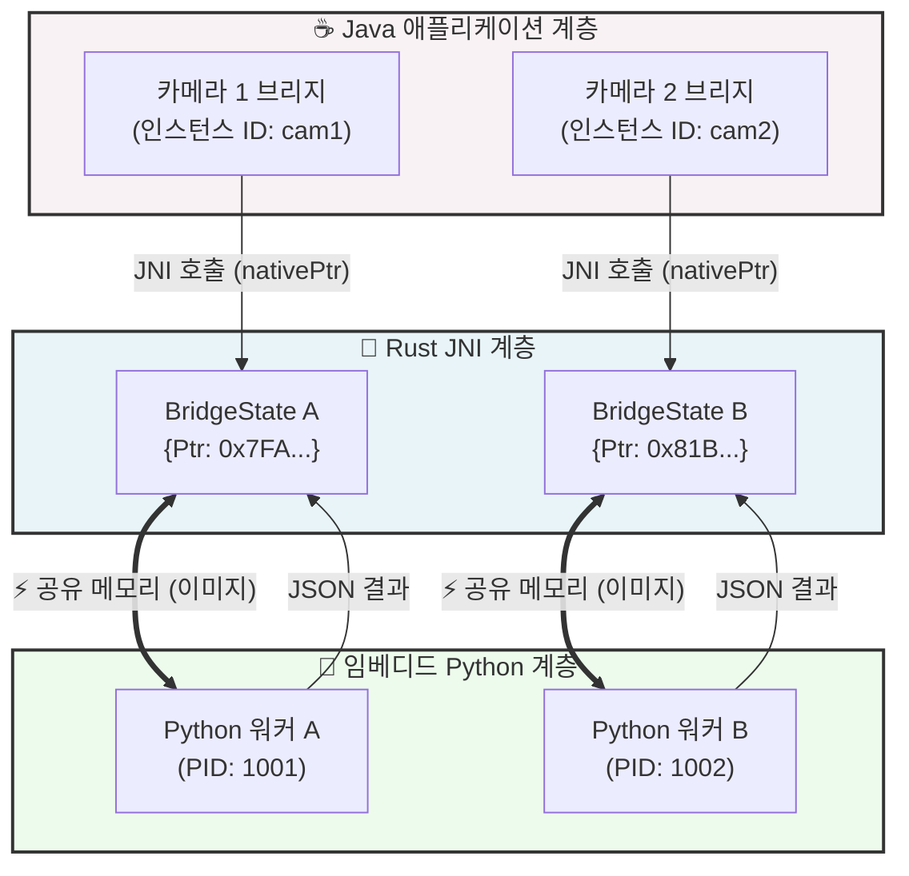
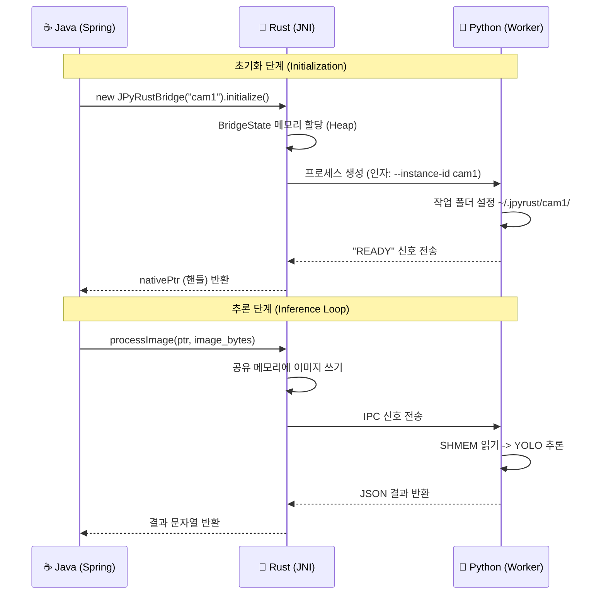

# 🚀 JPyRust: 고성능 유니버설 AI 브리지

> **"매 호출마다 서브프로세스를 띄우는 대신, JNI + 공유 메모리로 상시 대기 중인 Python 워커에 접근합니다."**

[](https://github.com/farmer0010/JPyRust/actions)
[](https://jitpack.io/#farmer0010/JPyRust)
[](LICENSE)


<p align="center">
  <a href="https://openjdk.org/">
    
  </a>
  <a href="https://www.rust-lang.org/">
    
  </a>
  <a href="https://www.python.org/">
    
  </a>
</p>

<div align="center">
  <a href="README.md">🇺🇸 English Version</a> · <a href="docs/GUIDE_KR.md">📚 사용자 가이드</a>
</div>

---

## 💡 프로젝트 소개

**JPyRust**는 **Java의 견고함**과 **Python의 AI 생태계** 간의 격차를 해소하기 위해 설계된 하이브리드 아키텍처입니다. **Spring Boot** 애플리케이션이 **네이티브에 가까운 성능**으로 무거운 AI 모델(YOLO, PyTorch, TensorFlow)을 실행할 수 있게 해줍니다.

느린 `ProcessBuilder`나 지연 시간이 긴 HTTP API와 달리, JPyRust는 **Rust JNI**와 **공유 메모리(SHMEM)**를 활용하여 밀리초(ms) 단위 미만의 초고속 통신을 달성합니다.

### 🌟 왜 JPyRust인가요?
* 🚀 **Zero-Latency (지연 없음)**: 느린 HTTP/Socket 대신 시스템 RAM(공유 메모리)을 직접 사용하여 데이터 교환.
* 🔄 **완벽한 병렬성 (True Parallelism)**: v1.3.0부터 **멀티 인스턴스** 아키텍처를 지원하여, 하나의 Java 앱이 여러 개의 독립적인 Python 프로세스를 동시에 제어할 수 있습니다.
* 🛠️ **Zero-Config (설정 불필요)**: 첫 실행 시 Python 환경을 자동으로 구성합니다 — Windows는 완전한 임베디드 배포판, macOS/Linux는 시스템 `python3` 기반의 격리된 venv. 수동 `pip install` 필요 없습니다.
* 🛡️ **Crash-Proof (충돌 방지)**: Rust가 Python 프로세스의 상태를 실시간 감시하며, 충돌 발생 시 즉시 워커를 자동 재시작합니다.

---

## 🏗️ 아키텍처 (v1.3.0)

**v1.3.0 업데이트**를 통해 JPyRust는 전역 싱글톤 패턴에서 벗어나 **멀티 인스턴스 객체 지향 아키텍처**로 완전히 전환되었습니다. 이를 통해 단일 Java 애플리케이션이 여러 개의 독립적인 AI 워커(예: 4채널 CCTV 동시 분석)를 효율적으로 제어할 수 있습니다.

### 🧩 시스템 컴포넌트 다이어그램


```mermaid
graph TD
    subgraph JavaApp [☕ Java 애플리케이션 계층]
        style JavaApp fill:#f9f2f4,stroke:#333,stroke-width:2px
        J1["카메라 1 브리지<br>(인스턴스 ID: cam1)"]
        J2["카메라 2 브리지<br>(인스턴스 ID: cam2)"]
    end

    subgraph NativeLayer [🦀 Rust JNI 계층]
        style NativeLayer fill:#e8f4f8,stroke:#333,stroke-width:2px
        R1["BridgeState A<br>{Ptr: 0x7FA...}"]
        R2["BridgeState B<br>{Ptr: 0x81B...}"]
    end

    subgraph PythonLayer [🐍 임베디드 Python 계층]
        style PythonLayer fill:#edfbec,stroke:#333,stroke-width:2px
        P1["Python 워커 A<br>(PID: 1001)"]
        P2["Python 워커 B<br>(PID: 1002)"]
    end

    J1 -- "JNI 호출 (nativePtr)" --> R1
    J2 -- "JNI 호출 (nativePtr)" --> R2
    
    R1 <== "⚡ 공유 메모리 (이미지)" ==> P1
    R2 <== "⚡ 공유 메모리 (이미지)" ==> P2
    
    P1 -- "JSON 결과" --> R1
    P2 -- "JSON 결과" --> R2
```

### ⚡ 실행 시퀀스 (Sequence)


```mermaid
sequenceDiagram
    participant Java as ☕ Java (Spring)
    participant Rust as 🦀 Rust (JNI)
    participant Py as 🐍 Python (Worker)

    Note over Java, Py: 초기화 단계 (Initialization)
    Java->>Rust: new JPyRustBridge("cam1").initialize()
    Rust->>Rust: BridgeState 메모리 할당 (Heap)
    Rust->>Py: 프로세스 생성 (인자: --instance-id cam1)
    Py->>Py: 작업 폴더 설정 ~/.jpyrust/cam1/
    Py-->>Rust: "READY" 신호 전송
    Rust-->>Java: nativePtr (핸들) 반환

    Note over Java, Py: 추론 단계 (Inference Loop)
    Java->>Rust: processImage(ptr, image_bytes)
    Rust->>Rust: 공유 메모리에 이미지 쓰기
    Rust->>Py: IPC 신호 전송
    Py->>Py: SHMEM 읽기 -> YOLO 추론
    Py-->>Rust: JSON 결과 반환
    Rust-->>Java: 결과 문자열 반환
```

---

## ⚡ 성능 벤치마크

직접 돌려볼 수 있는 실측 벤치마크가 레포에 포함되어 있습니다: [`LatencyBenchmark.java`](java-api/src/test/java/com/jpyrust/LatencyBenchmark.java). 실제 이미지(`sample.png`)에 대해 진짜 YOLOv8n 추론을 워밍업 후 10회 반복하며 다음 두 방식을 비교합니다.
- **레거시 Subprocess** — 호출할 때마다 새 Python 인터프리터를 띄우고 torch/ultralytics를 처음부터 임포트 + 모델 로드.
- **JPyRust (JNI + SHMEM)** — 모델이 이미 로드된 상시 대기 데몬 하나를 재사용하고, 이미지만 공유 메모리로 오갑니다.

| 아키텍처 | 통신 방식 | 지연 시간 (평균, 실측) |
| :--- | :--- | :---: |
| 레거시 Subprocess (매번 새 프로세스) | 표준 입출력 (Stdin/Out) | ~2,330ms |
| JPyRust (JNI + SHMEM, 상시 데몬) | 공유 메모리 (SHMEM) | ~6ms |

> *테스트 환경: Apple Silicon(arm64), macOS, PyTorch MPS(Metal) 가속, Python 3.12. 약 390배 차이이며 반복 실행에서도 일관되게 재현됨.*

"레거시" 쪽 시간의 거의 대부분은 매 호출마다 반복되는 1회성 오버헤드(torch/ultralytics 임포트, `YOLO(...)` 모델 생성)이고, 실제 추론 자체는 몇 ms에 불과합니다. 데몬 아키텍처는 그 비용을 요청마다가 아니라 시작 시 딱 한 번만 지불하는데, 이게 바로 상시 워커를 두는 이유 그 자체입니다. 직접 여러분 하드웨어에서 `LatencyBenchmark`를 돌려보시면 됩니다 — CPU/GPU, 이미지 크기에 따라 절대 수치는 달라지겠지만 "연산이 아니라 오버헤드가 지배한다"는 구조 자체는 일반적으로 유지될 겁니다.

<details>
<summary><strong>이 수치를 정직하게 얻기까지</strong></summary>

이전 버전의 벤치마크는 macOS에서 조용히 엉뚱한 걸 측정하고 있었습니다. Rust와 Python 사이의 POSIX 공유메모리 이름 불일치 때문에 모든 SHMEM 호출이 조용히 실패해서 15번 재시도 루프(순수 대기시간 ~1.8초, 연산 아님)를 타고 있었고, 벤치마크가 실제 이미지 대신 랜덤 바이트를 보내고 있어서 `cv2.imdecode`가 두 경로 모두에서 즉시 실패해 추론 자체가 한 번도 실행되지 않았습니다. 둘 다 지금은 고쳤습니다 — [버전 히스토리](#-버전-히스토리) 참고.
</details>

---

## 🚀 빠른 시작 (Quick Start)

### 1. 설치 (Gradle)
`build.gradle.kts` 파일에 JitPack 리포지토리와 의존성을 추가하세요:

```kotlin
repositories {
    maven { url = uri("[https://jitpack.io](https://jitpack.io)") }
}

dependencies {
    // 최신 안정 버전
    implementation("com.github.farmer0010:JPyRust:v1.3.1")
}
```

### 2. 사용법 (Java)

**중요:** v1.3.0부터 `static` 메서드가 제거되었습니다. 반드시 `JPyRustBridge` 객체를 생성해야 합니다.

```java
import com.jpyrust.JPyRustBridge;

public class VisionService {
    
    public void startDetection() {
        // 1. 각 카메라를 위한 독립적인 인스턴스 생성
        JPyRustBridge cam1 = new JPyRustBridge("cam1");
        JPyRustBridge cam2 = new JPyRustBridge("cam2");

        // 2. 기본값으로 초기화 (각각 ~/.jpyrust/camX 경로에 워커 프로세스 생성)
        cam1.initialize();

        // 2-1. (v1.3.1+) 커스텀 모델 & 신뢰도 임계값으로 초기화
        cam2.initialize("/path/to/workdir", "custom_model.pt", 0.25f);

        // 3. 이미지 처리 (스레드 안전)
        // 인자: (이미지데이터, 길이, 가로, 세로, 채널)
        byte[] result1 = cam1.processImage(imgData1, len1, 640, 480, 3);
        byte[] result2 = cam2.processImage(imgData2, len2, 640, 480, 3);
        
        System.out.println("Cam1 결과: " + new String(result1));
    }
}
```

---

## 🛠️ 설정 및 문제 해결 (Troubleshooting)

<details>
<summary><strong>🔧 1. UnsatisfiedLinkError / DLL을 찾을 수 없음</strong></summary>

* **원인:** Java가 네이티브 라이브러리(`dll`/`dylib`/`so`)를 찾지 못하는 경우입니다.
* **해결:** 라이브러리는 JAR 안에 번들되어 있고 자동으로 임시 파일로 추출됩니다 — `jpyrust.dll`(Windows), `jpyrust.dylib`(macOS), `jpyrust.so`(Linux). 그래도 안 되면 사용 중인 JAR의 `src/main/resources/natives/`에 해당 플랫폼 파일이 들어있는지 확인하세요.
</details>

<details>
<summary><strong>🛡️ 2. WinError 5 (Access Denied)</strong></summary>

* **원인:** Windows의 공유 메모리 생성 시 보안 권한 문제입니다.
* **해결:** JPyRust v1.2+ 버전은 `SECURITY_ATTRIBUTES`와 SDDL `D:(A;;GA;;;WD)` 설정을 적용하여, 자식 프로세스가 권한 문제 없이 접근할 수 있도록 해결되었습니다. 별도 조치가 필요 없습니다.
</details>

<details>
<summary><strong>🐍 3. Python 의존성 문제</strong></summary>

* **Windows:** JPyRust는 **포터블 임베디드 Python**을 내장하고 있으며, `~/.jpyrust/<instanceId>/python_dist`에 자동으로 설치됩니다.
* **macOS / Linux:** 이 플랫폼용 포터블 임베디드 Python은 없어서, `PATH`에서 `python3`을 찾고(`python3.12` → `python3.11` → `python3.13` → `python3` 순으로 시도) `~/.jpyrust/<instanceId>/venv`에 전용 venv를 만들어 `requirements.txt`를 설치합니다. 인스턴스 디렉터리당 한 번만 실행되며(`.installed` 마커로 추적), 새로 설치하려면 해당 디렉터리를 지우면 됩니다.
* 라이브러리가 부족하다면 `resources` 폴더의 `requirements.txt`를 확인하세요.
</details>

---

## 📜 버전 히스토리

* **Unreleased**
    * **수정:** macOS/Linux에서 (동작 불가능한) Windows 전용 임베디드 배포판을 무조건 풀던 것을, 실제로 동작하는 Python venv를 구성하도록 수정.
    * **수정:** Rust가 macOS/Linux에서 만드는 공유 메모리 이름이 Python `multiprocessing.shared_memory`가 찾는 이름과 애초에 달랐습니다(`shm_open()`은 앞에 `/`가 필요한데 Rust 쪽에서 안 붙이고 있었음) — macOS의 모든 SHMEM 호출이 조용히 실패해서 15회 재시도 루프로 ~1.8초를 허비하고 있었습니다. 이제 양쪽 이름이 일치합니다.
    * **수정:** 공유 메모리 세그먼트 이름이 macOS의 `shm_open` 31자 제한을 넘는 문제도 있었음. 모든 플랫폼에서 이름을 짧게 유지하도록 변경.
    * **수정:** 네이티브 데몬이 `ai_worker.py`를 작업 디렉터리 바로 아래에서 찾았지만, 실제로는 `python_dist/` 안에만 배치되어 있어 데몬이 절대 찾을 수 없었던 경로 불일치 버그 수정.
    * **수정:** 레거시 subprocess 벤치마크 경로가 더 이상 지원되지 않는 방식(위치 인자)으로 `ai_worker.py`를 호출해서 무한 대기하던 버그 수정 — 이제 데몬과 동일한 EXECUTE/stdin 프로토콜을 사용합니다.
    * **수정:** `ai_worker.py`가 `torch.cuda.is_available()`만 확인해서 Apple Silicon의 Metal(MPS) 백엔드를 전혀 못 쓰고 있었음 — 이제 `mps`도 시도한 뒤 `cpu`로 폴백합니다.
    * **수정:** 벤치마크가 `cv2.imdecode()`로 디코딩하는 YOLO 태스크에 랜덤 바이트를 "이미지 데이터"로 보내고 있어서 즉시 디코딩 실패로 끝나고, 두 경로 모두 실제 추론을 한 번도 실행하지 않고 있었음 — 이제 실제 이미지를 보냅니다.

* **v1.3.1**
    * **Linux/Docker 지원:** `setupEmbeddedPython`이 OS를 감지해서 Linux에서는 Windows 전용 임베디드 배포판 대신 시스템 `python3`를 사용.
    * **커스텀 파라미터:** 커스텀 AI 모델 설정을 위한 `initialize(workDir, modelPath, confidence)` 오버로드 추가.
    * **하위 호환:** 기존 `initialize(workDir)`도 기본값(`yolov8n.pt`, `0.5f`)으로 그대로 동작.

* **v1.3.0**
    * **대규모 리팩토링:** 멀티 인스턴스(Multi-Instance) 아키텍처로 전환.
    * **Breaking Change:** Static 메서드 제거 및 생성자(`new`) 기반 초기화 도입.
    * **기능 추가:** 인스턴스별 작업 디렉토리 격리 (`~/.jpyrust/cam1`).

* **v1.2.0**
    * **성능:** Win32 API 직접 호출을 통해 Windows 환경에서 공유 메모리(SHMEM) 기능 복구.
    * **보안:** 커스텀 보안 기술자(Security Descriptor)를 적용하여 `WinError 5` 근본 해결.

* **v1.1.0**
    * 초기 Windows 지원 및 파일 기반 IPC 폴백 모드 추가.

---

## 📄 라이선스

이 프로젝트는 **MIT 라이선스**를 따릅니다. 자세한 내용은 [LICENSE](LICENSE) 파일을 참조하세요.

<div align="center">
  <sub>Built with 🦀 Rust & ☕ Java by Farmer0010 (JPyRust Team).</sub>
</div>
